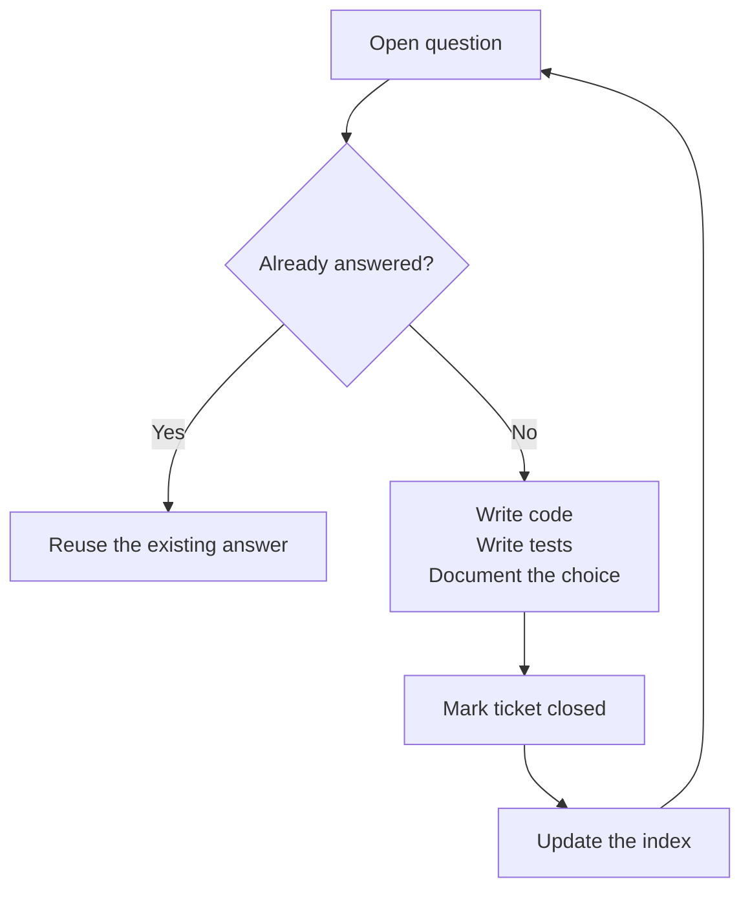
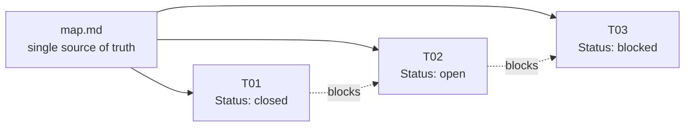
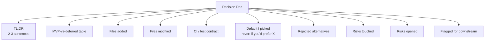
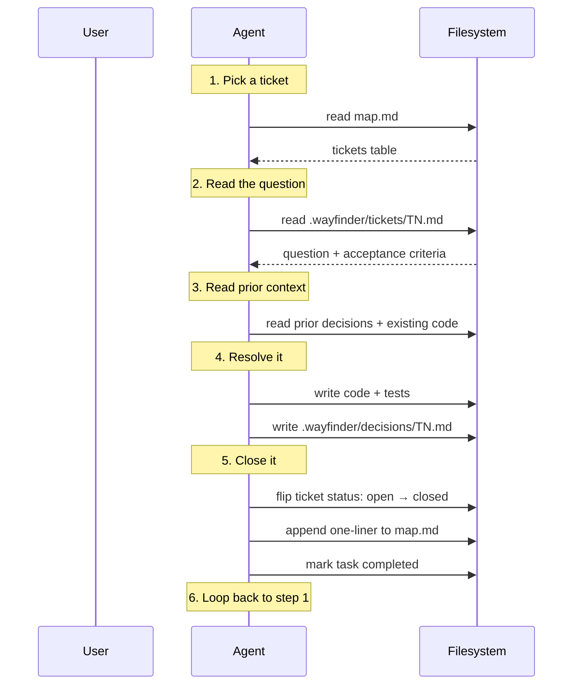
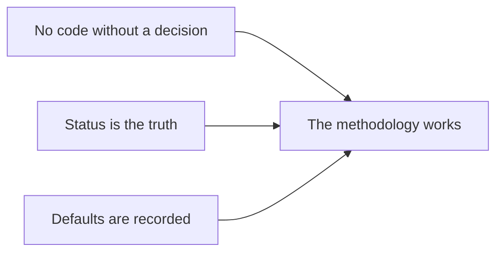
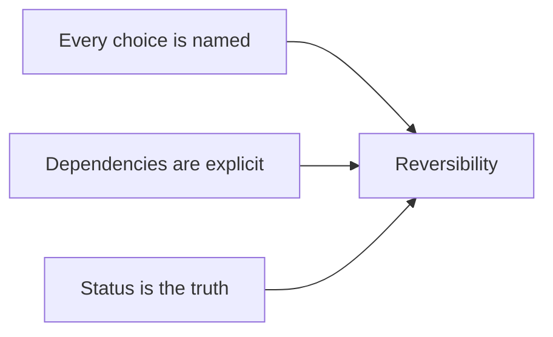

# Way-Finder × Puku CLI — A Guide

> A methodology for building software with an autonomous agent,
> paired with the agent harness that runs it end-to-end. This guide
> is the public version: no project names, no internal jargon,
> nothing that assumes you've seen Way-Finder before.

---

## What is Way-Finder?

Way-Finder is a **planning discipline** for AI-assisted builds.
It treats your project as a sequence of small, scoped questions —
called **tickets** — each of which has to be settled before any
code is written for it.

The whole methodology fits on a sticky note:



That's it. Everything else in this guide is the form that loop
takes on disk.

---

## What is Puku CLI?

Puku CLI is the agent harness that runs Way-Finder for you. It
exposes:

- A **file-based planning layer** that reads and writes the
  Way-Finder directories (`.wayfinder/`)
- A **tool surface** for reading, writing, editing, and running
  shell commands
- A **task tracker** as a soft in-session progress indicator
- An **auto mode** that lets the agent finish a build end-to-end
  without pausing for permission on routine decisions

The harness doesn't add new concepts to Way-Finder — it just
operationalizes the loop above.

---

## The directory layout (everything lives in `.wayfinder/`)

Create this skeleton once at the root of your project:

```
.wayfinder/
├── README.md          ← the methodology in 2 pages
├── map.md             ← THE index (single source of truth)
├── tickets/
│   ├── T01.md         ← one ticket per file
│   ├── T02.md
│   └── ...
├── decisions/
│   ├── T01.md         ← one resolution per closed ticket
│   └── ...
└── risks/
    └── R00.md         ← risk register entries
```

Every other action in the build is a function of these files:

| Agent action | Reads | Writes |
| ------------ | ----- | ------ |
| Pick next ticket | `map.md` tickets table | — |
| Read the question | `.wayfinder/tickets/T<N>.md` | — |
| Resolve it | existing code + prior decisions | `.wayfinder/decisions/T<N>.md` |
| Close it | — | flips `Status: open → closed` in the ticket |
| Update the index | — | appends a one-liner to "Decisions so far" in `map.md` |

---

## The map is the single source of truth

`map.md` is the index. It has exactly three sections:



1. **Tickets table** — one row per ticket with status
2. **Decisions so far** — one-line summary per closed ticket
3. **Frontier** — the smallest open, unblocked ticket

If two files in `.wayfinder/` disagree, `map.md` wins.

---

## Anatomy of a ticket

Every ticket follows the same template. The rendered example below
shows how a real ticket looks once it lands in
`.wayfinder/tickets/T07.md`:

---

> ### T07 — Authentication strategy
>
> **Type:** grilling (HITL)
> **Mode:** Human-in-the-loop
> **Status:** open
> **Blocked by:** T03
> **Blocks:** T08, T09
> **Milestone:** 4 — Identity
>
> **Question**
>
> How do users sign in, and what do we defer?
>
> **Why it matters**
>
> Auth is the difference between a demo and a product.
>
> **What needs to be settled**
>
> - Session vs JWT
> - OAuth provider vs roll-your-own
> - Where the user store lives
> - Password reset posture
>
> **Acceptance criteria**
>
> - `.wayfinder/decisions/T07.md` records the choice.
> - A working `/login` endpoint exists.
>
> **Estimated complexity**
>
> Low–Medium.
>
> **Risks if not resolved**
>
> Insecure defaults; rework in two months when we add real users.

---

Three fields are non-negotiable:

- **Status** — `open` or `closed`. The agent only works on `open`.
- **Blocked by** — explicit dependency on prior closed tickets.
- **Acceptance criteria** — what "done" looks like for this ticket.

---

## Anatomy of a decision doc

When a ticket closes, the agent writes a decision doc with the
same name under `decisions/`. The format:



The load-bearing section is **"Default I picked (revert if you'd
prefer X)"**. Every default the agent chose is recorded there so
a future session can revert it.

Example:

> ## Default I picked (revert if you'd prefer X)
>
> - **Session cookies, not JWT.** Sessions are revocable; JWTs
>   aren't. For an MVP with <1000 users, the cookie store fits
>   in memory. If you want JWT, swap the middleware and add a
>   refresh-token rotation policy.
> - **OAuth via Google only.** Avoids the password-reset
>   surface entirely. Add GitHub / Microsoft later via the same
>   OAuth callback.

Without this section, a future session can't tell whether a
choice was deliberate or accidental.

---

## The execution loop

For every ticket, the agent runs this loop once:



The loop is the entire methodology in motion.

---

## Ticket types

Three kinds of tickets, each with a different resolution style:

| Type | What it asks | What the agent does |
| ---- | ------------ | ------------------- |
| **grilling** | A judgement call with multiple defensible answers | Picks a default, records alternatives, moves on |
| **prototype** | "Build me something I can poke at" | Writes code, runs it, shows the output |
| **research** | "What are the options?" | Writes a survey doc; no production code |
| **task** | A concrete deliverable | Does the deliverable |

A grilling ticket that says "Pick the database" is the same shape
as a task that says "Set up CI" — the difference is in how much
judgment the agent needs to apply.

---

## Modes — how much autonomy does the agent have?

Puku CLI supports three interaction modes. They're per-session,
not per-ticket:

| Mode | When to use it | What the user does | What the agent does |
| ---- | -------------- | ------------------ | ------------------- |
| **Manual** | You're learning the methodology, or the build is risky | Approves every Bash call | Pauses for permission on every shell command |
| **Plan** | You want to review the approach before code lands | Reads the plan, approves once | Writes a plan, asks for approval, then runs |
| **Auto** | You want the build finished end-to-end | Sends "finish it" and walks away | Picks reasonable defaults, runs the loop, reports back |

For your first Way-Finder build, **Plan** is the safest. For the
second one, **Auto** is the fastest.

---

## A worked example — one ticket in 11 steps

Imagine you're building something with auth, and T07 is the
"Authentication strategy" ticket from earlier.

### Step 1 — Pick the ticket

Read `.wayfinder/map.md`, find the smallest `open` ticket whose
`blocked-by` chain is fully closed. T07 is unblocked (T03 is
closed), so it's a candidate.

### Step 2 — Read the question

```
> cat .wayfinder/tickets/T07.md
# T07 — Authentication strategy
**Status:** open
**Blocked by:** T03
```

The question is *"How do users sign in, and what do we defer?"*

### Step 3 — Read the prior context

Read every decision doc under `.wayfinder/decisions/` and the
code that exists. The decisions tell you what was locked. The
code tells you what the agent actually built.

### Step 4 — Pick defaults

For each open sub-question (sessions vs JWT, OAuth vs
roll-your-own, etc.), pick a default and remember to record it.

### Step 5 — Write the code

Add the auth module, the login route, the session middleware.
Run the linter. Run the tests. Make sure they pass.

### Step 6 — Write the tests

Marker convention (matches Puku CLI's default): `unit` for pure
logic, `integration` for routes and on-disk side effects. Skip
the network in default CI.

### Step 7 — Write the decision doc

> # T07 — Decision: Authentication strategy
>
> ## TL;DR
>
> Session cookies via OAuth (Google provider only at MVP). Users
> are stored in SQLite. Password reset deferred to v2.
>
> ## Default I picked (revert if you'd prefer X)
>
> - **Session cookies, not JWT.** ...
> - **OAuth via Google only.** ...
>
> ## Rejected alternatives
>
> - Roll-your-own password auth. (Insecure; we'd be reinventing
>   bcrypt + reset flows.)
> - Email-link magic auth. (Cool UX, but a separate ticket.)
>
> ## Files added
>
> - `src/auth/`
> - `tests/test_auth.py`
>
> ## CI / test contract
>
> - 12 unit tests pass.
> - `mypy src` clean.
> - `ruff check src tests` clean.

### Step 8 — Flip the ticket

```diff
- **Status:** open
+ **Status:** closed
```

### Step 9 — Update the map

Append a one-liner:

```diff
+ - **T07** — Session cookies + Google OAuth; SQLite user store;
+   password reset deferred. 12 tests; mypy + ruff clean.
+   Details in `.wayfinder/decisions/T07.md`.
```

### Step 10 — Mark the task completed

In Puku CLI:

```
[TaskUpdate] T07 → completed
```

### Step 11 — Loop back

Pick the next smallest open, unblocked ticket. Repeat.

---

## The discipline — three rules that hold the system together



### Rule 1 — No code without a decision

Every file in your project traces back to a ticket. No silent
additions. If the agent wants to add a new utility, it has to
open a new ticket first.

### Rule 2 — Status is the truth

The agent only works on tickets with `Status: open`. If a
ticket says `closed`, the agent reads it for context but doesn't
touch it. The on-disk tickets are the primary index; the
in-session task tracker is secondary.

### Rule 3 — Defaults are recorded

Every "I'll pick X" moment is under "Default I picked (revert
if you'd prefer X)" in the decision doc. A future session can
revert any default by editing the relevant code and updating
the decision doc. Nothing is silent.

---

## The autonomy matrix — what the agent does in each mode

Puku CLI's auto mode is the headline feature. Here's the full
matrix:

| Action | Manual | Plan | Auto |
| ------ | :----: | :--: | :--: |
| Read files | ✅ auto | ✅ auto | ✅ auto |
| Write new files | ✅ auto | after approval | ✅ auto |
| Edit existing files | ✅ auto | after approval | ✅ auto |
| Run linter | ✅ auto | ✅ auto | ✅ auto |
| Run tests | ✅ auto | ✅ auto | ✅ auto |
| Install packages (`uv sync`, `npm install`) | ask | after approval | ✅ auto |
| Destructive ops (`git reset --hard`, `rm -rf`) | ask | ask | **ask** |
| Force push to `main` | **ask** | **ask** | **ask** |
| Pick a default for a grilling ticket | ask | after approval | ✅ auto + record under "Default I picked" |

The last row is the one that matters most. In auto mode, the
agent picks defaults and **records them**. That's the whole
point of the decision doc format.

---

## A note on scope

Way-Finder works because it forces three things:



The cost is bureaucratic overhead — one decision doc per ticket,
one one-liner per ticket in the map, one status flip per ticket.

The benefit is that every step is reversible and every default
is recoverable. If you want to swap SQLite for Postgres, or
add a different OAuth provider, or upgrade the model, the
documentation already points at the relevant files.

That's the methodology. Puku CLI is the harness that lets the
agent run the loop without you having to type at every step.

---

## Quick reference

### File layout

```
.wayfinder/
├── README.md
├── map.md
├── tickets/
│   └── TNN.md
├── decisions/
│   └── TNN.md
└── risks/
    └── RNN.md
```

### Ticket template

> # TNN — Title
>
> **Type:** grilling | prototype | research | task
> **Mode:** HITL | AFK | either
> **Status:** open
> **Blocked by:** ...
> **Blocks:** ...
>
> ## Question
> ## Why it matters
> ## What needs to be settled
> ## Acceptance criteria
> ## Estimated complexity
> ## Risks if not resolved

### Decision doc template

> # TNN — Decision: Title
>
> ## TL;DR
> ## MVP-vs-deferred table
> ## Files added
> ## Files modified
> ## CI / test contract
> ## Default I picked (revert if you'd prefer X)
> ## Rejected alternatives
> ## Risks touched
> ## Risks opened
> ## Flagged for downstream

### Map update on close

```diff
+ - **TNN** — One-line summary. Details in
+   `.wayfinder/decisions/TNN.md`.
```

### Status flip

```diff
- **Status:** open
+ **Status:** closed
```

That's the whole methodology. Open Puku CLI, point it at your
project, write the first ticket, run the loop.
