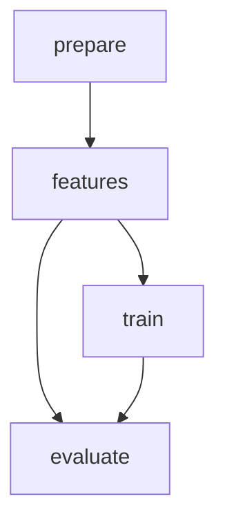

# DVC Viva Guide — Credit Risk Intelligence

This document explains every DVC command and concept that may come up
in your MLSD viva, with **real commands from this project**.

---

## 1. `dvc init`

**What it does:** Initialises DVC inside an existing Git repository.
It creates a `.dvc/` directory containing the cache, config, and
local state. DVC is *additive* — it never replaces Git.

**When you run it (this project):**

```bash
$ dvc init
Initialized DVC repository.
```

DVC also writes `.dvc/.gitignore` which keeps `.dvc/cache/` out of
Git. The remaining files in `.dvc/` (`config`, `state`, `lock`,
`updater/`, `tmp/`) are tracked by Git.

**Why use it:** DVC is the version-control system for *data* and
*ML artifacts*. Git is great at source code; DVC is great at
gigabyte-scale files that change in content-addressed ways.

---

## 2. `dvc add`

**What it does:** Tracks a file (or directory) with DVC. DVC:

1. Computes a content hash (MD5 by default) of the file.
2. Moves the file into `.dvc/cache/<first-2-chars>/<rest>`.
3. Replaces the original file with a tiny `.dvc` pointer file
   (`file.dvc`) that records the hash and the file's path.
4. Adds the file to the local `.dvc/.gitignore` so the original
   doesn't get accidentally re-tracked by Git.

**When you run it (this project):**

```bash
$ dvc add data/raw/application_train.csv
$ git add data/raw/application_train.csv.dvc data/raw/.gitignore
$ git commit -m "data: track application_train.csv with DVC"
```

After this, the 160-MB CSV lives in `.dvc/cache/` (gitignored) and a
~200-byte pointer file lives in `data/raw/application_train.csv.dvc`
(git-tracked). **DVC owns the data; Git owns the pointer.**

**Why use it:** Without `dvc add`, large files either bloat Git
(unusable) or get silently gitignored (no history). DVC tracks
content, not bytes — two CSV files that are byte-identical share the
same cache entry.

---

## 3. `dvc repro`

**What it does:** Reproduces the pipeline defined in `dvc.yaml`.
For each stage, DVC:

1. Compares the stage's `deps` and `params` against the hash recorded
   in `dvc.lock`.
2. If anything has changed (or the output is missing), it re-runs the
   stage's `cmd`.
3. If nothing has changed, it skips the stage.
4. Updates `dvc.lock` with the new hashes.

**When you run it (this project):**

```bash
$ dvc repro
Running stage 'prepare':
> python src/prepare.py
...
Running stage 'features':
> python src/features.py
...
Running stage 'train':
> python src/train.py
...
Running stage 'evaluate':
> python src/evaluate.py
...
```

**The key invariant:** `dvc repro` is **idempotent and incremental**.
Run it twice in a row with no changes and you'll see:

```bash
$ dvc repro
Stage 'prepare' didn't change, skipping
Stage 'features' didn't change, skipping
Stage 'train' didn't change, skipping
Stage 'evaluate' didn't change, skipping
Data and pipelines are up to date.
```

**Why use it:** Makes the entire ML pipeline reproducible from
`dvc.yaml` + `params.yaml` + the tracked data. No "remember to run
this script before that script" — the dependency graph IS the
documentation.

---

## 4. `dvc status`

**What it does:** Reports which stages are dirty (have changed
dependencies, changed parameters, or missing outputs) and which
are clean.

**When you run it (this project):**

```bash
$ dvc status
Data and pipelines are up to date.
```

If you change a parameter:

```bash
# params.yaml:  learning_rate: 0.05  →  learning_rate: 0.10
$ dvc status
train:
	changed deps:
		params.yaml:
			modified:           model.learning_rate
```

If the tracked dataset changes:

```bash
# data/raw/application_train.csv was modified (different content)
$ dvc status
prepare:
	changed deps:
		modified:           data\raw\application_train.csv
```

If you change a source script:

```bash
# src/prepare.py was edited
$ dvc status
prepare:
	changed deps:
		modified:           src\prepare.py
```

**Why use it:** Tells you exactly what will be re-run before you
commit to a `dvc repro`. Catches stale-lock-file mistakes.

---

## 5. `dvc dag`

**What it does:** Prints the pipeline's dependency graph as ASCII
art (default) or Mermaid / dot.

**When you run it (this project):**

```bash
$ dvc dag
         +---------+
         | prepare |
         +---------+
              *
              *
              *
        +----------+
        | features |
        +----------+
         **        **
       **            *
      *               **
+-------+               *
| train |             **
+-------+            *
         **        **
           **    **
             *  *
        +----------+
        | evaluate |
        +----------+
```

Or as Markdown:

```bash
$ dvc dag --md
```



**Why use it:** A picture of the data lineage. If your `evaluate`
stage depends on the `train` output, the arrow shows it.

---

## 6. `dvc push`

**What it does:** Uploads all tracked data + pipeline outputs to the
configured DVC remote (default: a local file-system path; alternatives
include S3, GCS, Azure, SSH, GDrive, HTTP).

**When you run it (this project):**

```bash
$ dvc remote add -d mlsd_local /path/to/remote
$ dvc push
10 files pushed
```

**What's pushed:** every file that DVC owns. In this project, that
includes:

- `data/raw/application_train.csv` (the tracked raw data)
- `data/processed/*.parquet` and `*.npz` (intermediate outputs)
- `reports/cleaning_summary.md`, `reports/selected_features.json`,
  `reports/evaluation/*.png`, `reports/metrics.json`
- `models/*.pkl`, `models/feature_columns.json`

**What's NOT pushed:** source code, `dvc.yaml`, `params.yaml`,
`.dvc/config` (remote URL) — those go to Git.

**Why use it:** Sharing data with collaborators. The remote is the
shared truth; the local cache is a fast working copy.

---

## 7. `dvc pull`

**What it does:** Downloads all tracked data from the remote into
the local cache. Inverse of `dvc push`.

**When you run it (this project):**

```bash
$ dvc pull
```

After `git clone` + `dvc pull`, the local cache has every data file
the pipeline needs. Then `dvc repro` is a no-op (everything is
already cached).

**Why use it:** Onboarding. A new collaborator runs `git clone`,
installs dependencies, runs `dvc pull`, and has a fully-reproducible
workspace. No need to email around 160-MB CSV files.

---

## 8. `dvc.yaml`

**What it is:** The pipeline definition. YAML, parsed by DVC, four
sections:

```yaml
stages:
  <name>:
    cmd: <command to run>
    deps: [<files this stage reads>]
    params: [<param paths from params.yaml this stage reads>]
    outs: [<files this stage writes>]
    metrics: [<files with metrics>]
```

**When you read it (this project):** see `dvc.yaml` at the repo root.
Every stage's `cmd` is a single Python script invocation; `deps`,
`outs`, and `params` are explicit lists. There is no magic.

**Why use it:** The `dvc.yaml` file is the single source of truth
for the pipeline. No script depends on another script being run
"first"; the dependency graph in `dvc.yaml` is the contract.

---

## 9. `params.yaml`

**What it is:** The single file holding every experiment
hyperparameter. Read by every stage listed in `dvc.yaml`'s
`params:` block.

**When you read it (this project):** see `params.yaml` at the repo
root. Sections:

- `data:` — split sizes + random seed
- `preprocessing:` — missing-fraction threshold, cardinality
  threshold
- `features:` — top-N
- `model:` — XGBoost hyperparameters
- `baseline:` — Logistic Regression hyperparameters
- `evaluation:` — primary metric + threshold

**Why use it:** One file, one place to change an experiment. DVC
tracks changes to `params.yaml` automatically — change one number,
run `dvc status`, see which stages will be invalidated.

---

## 10. DVC cache (the `.dvc/cache/` directory)

**What it is:** A content-addressed store. Every file DVC tracks is
identified by its MD5 hash. The cache is at `.dvc/cache/<2-char
prefix>/<rest of hash>`.

**Why use it:** Two CSV files that are byte-identical share the same
cache entry — no duplication. Renaming a tracked file doesn't
duplicate storage; only the `.dvc` pointer moves.

**Note:** the cache is gitignored. It can be deleted at any time —
`dvc repro` or `dvc pull` will repopulate it.

---

## 11. The DVC-tracked dataset

**What it is:** In this project, `data/raw/application_train.csv` is
the only DVC-tracked dataset. After `dvc add`, the actual bytes live
in `.dvc/cache/` and the working directory has a symlink-ish pointer
(`application_train.csv.dvc`).

**Why use it:** The raw dataset is the seed of every downstream
artifact. If you change the raw CSV (even by one byte), DVC knows,
and every downstream stage's hash changes, and `dvc repro` will
re-run the entire pipeline.

---

## 12. Git vs DVC — the conceptual split

| Concern | Git | DVC |
|---|---|---|
| Source code | ✓ | — |
| `dvc.yaml`, `params.yaml`, docs | ✓ | — |
| Raw CSV (160 MB) | — | ✓ (`dvc add`) |
| Intermediate parquets | — | ✓ (as pipeline outputs) |
| Trained model (joblib) | — | ✓ (as pipeline outputs) |
| Metrics | — | ✓ (`metrics:` in `dvc.yaml`) |
| Plots | — | ✓ (`outs:` in `dvc.yaml`) |
| `.dvc/cache/` | — | ✓ (local cache; gitignored) |
| `.dvc/config` (remote URL) | ✓ | — |
| `.dvc/.gitignore` | ✓ | — (DVC-managed) |

**Rule of thumb:** if it's text, Git tracks it. If it's a
gigabyte-scale artifact that changes in content-addressed ways, DVC
tracks it. Both systems share the same directory; they don't
conflict.

---

## 13. Why `dvc repro` does not rerun every stage every time

Each stage's "freshness" is determined by a hash computed over:

- Every file in `deps:` (input files + source code).
- Every value in `params:` that the stage reads.
- The content hash of every file in `outs:` from the previous run.

If all three match `dvc.lock`, the stage is "up to date" and DVC
skips it. This is why a no-op `dvc repro` is instant — DVC doesn't
even invoke `python`.

The lock file (`dvc.lock`) is updated **only** when a stage actually
runs, so it's a durable record of what the pipeline produced last.

---

## 14. What happens when the dataset changes

1. The MD5 hash of `data/raw/application_train.csv` changes.
2. `dvc status` reports the `prepare` stage as dirty (its `deps`
   include the raw CSV).
3. `dvc repro` re-runs `prepare`, producing a new
   `train_clean.parquet` with a new hash.
4. The `features` stage's `deps` include `train_clean.parquet`, so
   its hash also changed — DVC re-runs it.
5. Same cascade for `train` and `evaluate`.

DVC reruns only the affected stages. `dvc dag` shows the cascade.

---

## 15. What happens when `params.yaml` changes

1. DVC parses `params.yaml` and computes the hash of the values each
   stage reads.
2. If a value changes for one stage, only that stage is marked
   dirty.
3. DVC reruns that stage + every downstream stage that depends on
   its outputs.

Example: change `model.learning_rate` from `0.05` to `0.10`. Only
the `train` and `evaluate` stages rerun. `prepare` and `features`
are skipped because their params and deps didn't change.

---

## 16. Common viva questions, with project-specific answers

**Q: What does `dvc repro` do?**
A: It runs only the pipeline stages that have stale inputs (deps,
params) or missing outputs, in the order dictated by the dependency
graph in `dvc.yaml`. It updates `dvc.lock` with the new hashes.

**Q: Why are we using DVC?**
A: Git cannot version large files (160-MB CSVs, multi-MB model
artifacts) efficiently. DVC adds content-addressed storage, a
pipeline definition, and experiment tracking, while remaining
fully compatible with Git.

**Q: What is `dvc.yaml`?**
A: The pipeline definition. Four stages (prepare, features, train,
evaluate), each with explicit `cmd`, `deps`, `outs`, `params`, and
(in `evaluate`'s case) `metrics`. DVC parses this file to build the
DAG.

**Q: What is `params.yaml`?**
A: A single YAML file holding every experiment hyperparameter. DVC
tracks changes to it. Changing a value and running `dvc repro`
reruns only the affected stages.

**Q: How does DVC know which stage needs to rerun?**
A: Hashes. DVC hashes the `deps`, the `params` read by each stage,
and the `outs` from the previous run. If any hash differs from the
recorded value in `dvc.lock`, the stage is stale and reruns.

**Q: What happens if the dataset changes?**
A: DVC detects the new MD5 hash of the raw CSV. `prepare` becomes
dirty, reruns, produces a new `train_clean.parquet` whose hash
differs from the previous one. `features`, `train`, and `evaluate`
cascade downstream.

**Q: What happens if a parameter changes?**
A: DVC detects the new value in `params.yaml`. Only the stages that
read that parameter (and the stages downstream of their outputs)
are rerun.

**Q: Difference between Git and DVC?**
A: Git versions text (source code, configs, docs). DVC versions
data + ML pipeline state (large files, model artifacts, metrics).
Git commits are content-diffs of source files; DVC commits are
hashes of data + pipeline outputs.

**Q: What do `dvc push` and `dvc pull` do?**
A: `dvc push` uploads DVC-tracked files to the configured remote
(S3, GDrive, local, etc.). `dvc pull` downloads them. Neither
touches source code (which is Git's job).

**Q: How can another person reproduce the experiment?**
A:
```bash
git clone <repo>
cd <repo>
python -m venv .venv
source .venv/bin/activate  # or .venv\Scripts\Activate.ps1 on Windows
pip install -r requirements.txt
dvc pull            # downloads the raw dataset + any cached outputs
dvc repro           # regenerates everything from scratch
```

If no remote is configured, replace `dvc pull` with "place
`application_train.csv` at `data/raw/`" and `dvc repro` will do the
rest.