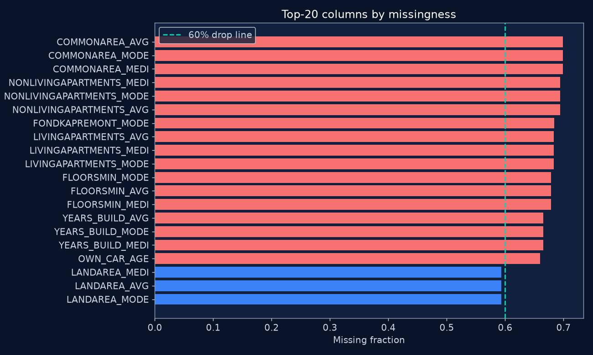
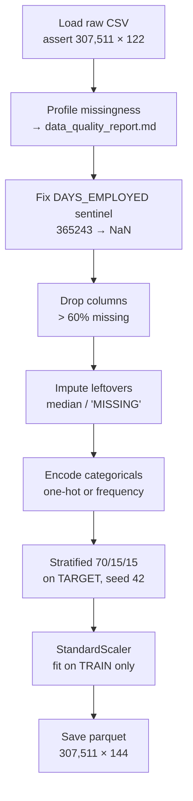
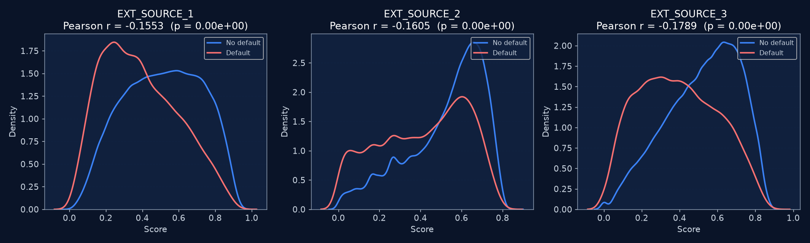
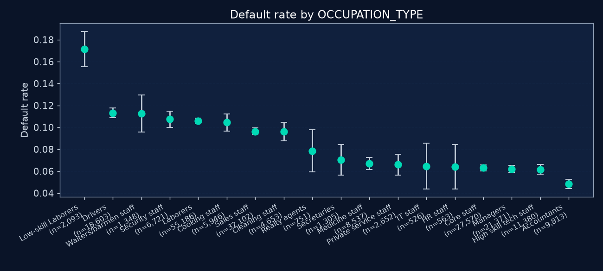
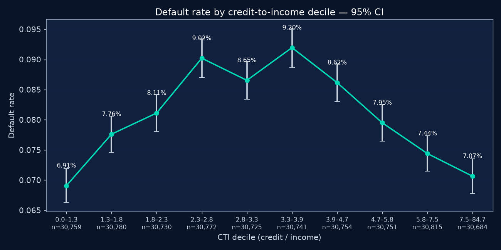
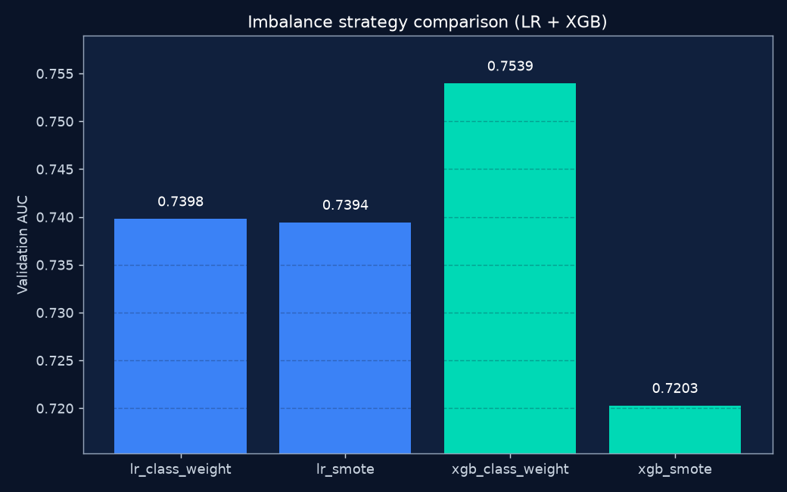
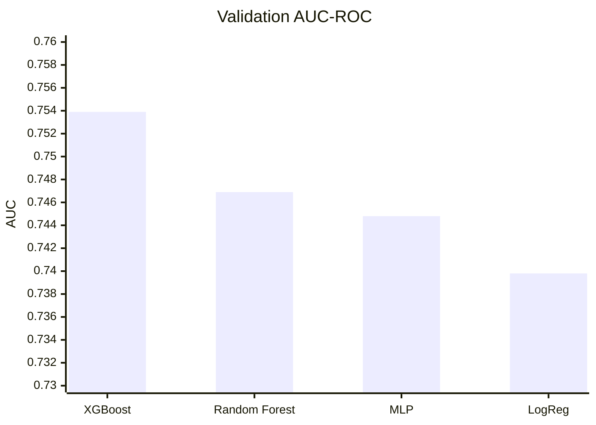
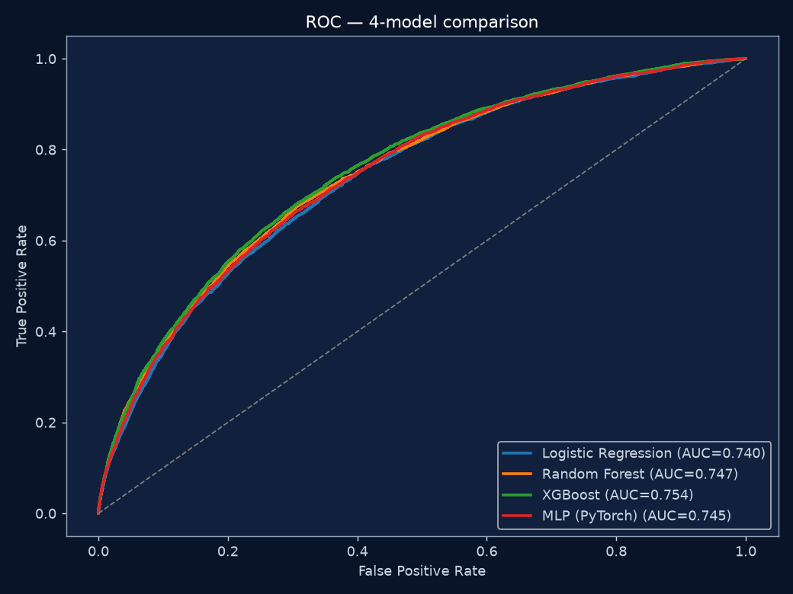
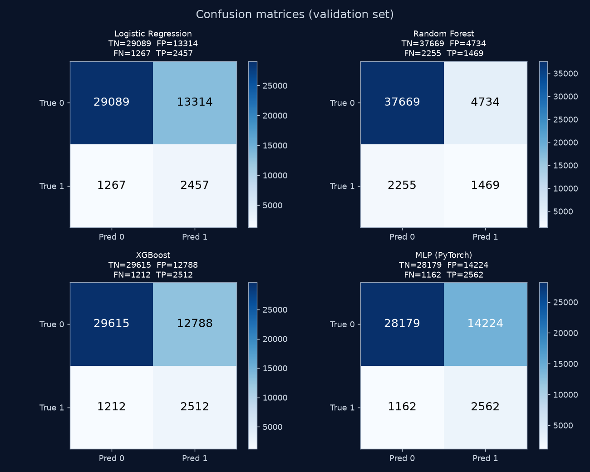

# Credit Risk Intelligence — Progress Presentation

**Course:** UIU Data Analytics Laboratory · **Group:** DomainRange (Musfique Ahmed, Tasfiya Binte Karim)
**Dataset:** Home Credit Default Risk — `application_train.csv` only (307,511 loans × 122 columns)
**Today's scope:** data cleaning → exploratory analysis → model implementations

> **How to use this file:** each numbered section is one slide. The **Talk track** is what you say out
> loud; the tables and figures are what stays on screen. Total runtime ≈ 12 minutes.
> Deeper "why not X" defences live in [`PROGRESS_UPDATE.md`](PROGRESS_UPDATE.md).

---

## 1. Where we stand

We have an end-to-end default-forecasting pipeline running. Raw data comes in at 307,511 loans and
122 columns; after cleaning we work with 144 columns on a frozen stratified 70/15/15 split. EDA
produced three formally tested hypotheses, feature work reduced the space to a top-30 set, and a
four-model comparison picked **XGBoost** at **validation AUC 0.7539** and **test AUC 0.7578**. The
model is wrapped in a three-way Approve / Manual Review / Reject scorer and surfaced through a
Streamlit dashboard.

| Phase | Deliverable | Status |
|---|---|---|
| 1 — Data cleaning | `notebooks/00_data_cleaning.ipynb` → `train_clean.parquet` (307,511 × 144) | Done |
| 2 — EDA | `notebooks/01_eda.ipynb` → 12 figures + 3 hypothesis tests | Done |
| 3 — Feature work | 7 engineered features → top-30 set | Done |
| 4 — Modelling | 4 model families → XGBoost winner + `score_application()` | Done |
| 5 — Dashboard | 4-tab Streamlit app | Done |
| — Verification | 23 pytest tests across 4 files | Passing |

**Talk track:** "The pipeline is complete end to end. I'll walk through the three parts you asked
about — how we cleaned the data, what the exploration found, and how the four models compare."

---

# Part I — Data Cleaning

## 2. What the raw data actually looked like

Before deciding anything we profiled the file. Three problems showed up, and each one drove a
cleaning decision.

| Property | Value | Why it matters |
|---|---|---|
| Shape | 307,511 rows × 122 columns | Large enough for a real holdout *and* cross-validation |
| Data types | 41 integer, 65 float, 16 object | We need encoding, not just scaling |
| Default rate | **8.07%** (24,825 defaults vs 282,686 repaid) | ~92/8 imbalance — accuracy is a useless metric here |
| Worst missingness | Housing fields at **66–70%** missing | Cannot be imputed honestly |
| Hidden sentinel | `DAYS_EMPLOYED == 365243` in **55,374** rows | Encodes "unemployed", reads as a 1,000-year job |

**Talk track:** "The headline problem is not size, it's honesty of the values. Eight percent of
applicants default, seventeen columns are two-thirds empty, and fifty-five thousand rows carry a
placeholder that would read as a thousand-year employment history if we left it alone."

---

## 3. The cleaning pipeline — order matters

Cleaning lives in a visible notebook, `notebooks/00_data_cleaning.ipynb`, not a hidden script. It
runs top to bottom in eleven sections, and every step prints what it changed.

| Step | What we did | Result |
|---|---|---|
| Sentinel | Replace `365243` with NaN, then impute like any other gap | **55,374** rows corrected |
| Drop | Remove columns above **60%** missing | **17** columns dropped |
| Impute | Numeric → column **median**; categorical → literal **`'MISSING'`** | **51** columns filled |
| Encode | ≤ 10 unique values → one-hot (`drop_first`); > 10 → frequency | **13** one-hot, **2** frequency |
| Split | Stratified on `TARGET`, seed 42 | 215,257 / 46,127 / 46,127 |
| Scale | `StandardScaler` on numeric features | Fit on the **train mask only** |

The seventeen dropped columns are almost entirely the housing AVG/MODE/MEDI triples —
`COMMONAREA_*` at 69.9%, `NONLIVINGAPARTMENTS_*` at 69.4%, `LIVINGAPARTMENTS_*` at 68.4%,
`FLOORSMIN_*` at 67.9%, `YEARS_BUILD_*` at 66.5% — plus `FONDKAPREMONT_MODE` at 68.4% and
`OWN_CAR_AGE` at 66.0%. `SK_ID_CURR`, `TARGET`, and `SPLIT` are never scaled.

**Talk track:** "The order is deliberate. Fix the sentinel before imputing, or the median gets
poisoned. Drop before imputing, or we invent values for columns we're about to delete. And split
before scaling, so the scaler never sees validation or test data."

---

## 4. Cleaning decisions we can defend

Every choice had a rejected alternative. These are the four most likely to be challenged.

| Decision | We chose | We rejected | Why |
|---|---|---|---|
| Sentinel handling | Set to NaN, then impute with everything else | Leave as 365243, or delete the 55,374 rows | Leaving it dominates any scale-sensitive model. Deleting it discards 18% of applicants who are genuinely unemployed or unknown-occupation — a real, risky population. |
| Drop threshold | **60%** missing | 50% (too aggressive) or 80% / keep-all with fancy imputation | The housing triples are both mostly empty *and* redundant with each other. At 60% we still keep `LANDAREA_*` at 59.4%. Above 60% we'd be modelling on invented numbers. |
| Numeric imputation | **Median** | Mean, KNN, or MICE | Income and credit are long-tailed, so the mean is dragged by outliers. KNN and MICE are slow at 300k × 100+ and leak if fitted across all rows. |
| Categorical imputation | Explicit **`'MISSING'`** category | Mode fill | Mode pretends we know the applicant's occupation. Missingness is itself a signal — people who skip housing fields differ from people who answer. |
| Encoding | One-hot below 10 levels, **frequency** above | One-hot everything, or target encoding | One-hot on `ORGANIZATION_TYPE` explodes the column count. Frequency encoding uses target-**independent** counts, so there is no leakage. |
| Split | **Stratified** 70/15/15 | Random split, or 80/20 with no validation set | A random split can starve the test set of the 8% minority. We need validation to pick the model and a frozen test set for the final number. |
| Scaling | Train-only `StandardScaler` | Scale the whole table, or skip scaling | Scaling before splitting leaks validation and test means into training. Trees don't need scaling but logistic regression and the MLP do, so one shared scaled table keeps all four models comparable. |

**Verification:** `tests/test_clean.py` asserts all three critical rules on a toy frame — the
sentinel becomes NaN, the >60% columns disappear, and the scaler is fitted on the train slice only.
The notebook itself ends with sanity checks: no NaNs remain, no sentinel survives, train means ≈ 0.

**Talk track:** "If you take one thing from this section: the median-versus-mean choice and the
train-only scaler are the two decisions that protect everything downstream."

---

# Part II — Exploratory Data Analysis

## 5. How we explored — hypothesis-driven, not chart-driven

We did not plot 122 histograms. We pre-registered three business questions and were willing to
reject any of them. We also deliberately used **two** tables: `df_raw` for original categoricals and
sentinel-aware employment plots, and `df_clean` for numeric correlations, so that missingness
doesn't punch holes in the correlation matrix.

| Section | What we examined | Method |
|---|---|---|
| Univariate | Target balance, income, credit, age, employment | Histograms on **log scale** for income and credit (long tails) |
| Bivariate | Credit-to-income ratio vs default | Default rate by CTI decile with 95% CI |
| H1 | `EXT_SOURCE_1/2/3` bureau scores | Pearson correlation + p-value |
| H2 | Leverage | Decile shape, then logistic regression with a confounder added |
| H3 | Education, occupation, contract type | χ² test + Cramér's V effect size |
| Multivariate | Top-25 numerics vs `TARGET` | Correlation heatmap on cleaned data |

**Talk track:** "Volume of charts isn't evidence. We asked three questions a lender would actually
pay for, tested each one formally, and reported effect sizes — not just p-values, which are
meaningless at n = 307,000."

---

## 6. Findings 1 and 3 — the two that held up

**H1 — bureau scores predict default. SUPPORTED.**
All three `EXT_SOURCE_*` columns correlate negatively with default at r = **−0.16 to −0.18**,
p ≪ 1e-200. The mean of the three scores reaches a univariate AUC of about **0.65** on its own —
genuinely useful, but nowhere near enough alone.
*Business implication:* `EXT_SOURCE_3` should be a **required** field on every application.

**H3 — some segments are measurably riskier. SUPPORTED, but small effect.**
Low-skill labourers default at **17.2%** against accountants at **4.8%** — a **3.5×** gap. Education
is cleanly monotonic, from lower secondary at **10.9%** down to academic degree at **1.8%**. All
three χ² tests are significant at p ≪ 1e-200, but Cramér's V sits at only **0.03–0.08**.
*Business implication:* the segments are real and defensible as an adjunct, but they are **not** a
standalone underwriting rule.

**Talk track:** "H3 is the honest one. The p-value is astronomically small and the effect size is
tiny — both are true at once. That's exactly why we report Cramér's V: statistically certain, but
practically weak."

---

## 7. Finding 2 — the hypothesis we rejected

**H2 — higher credit-to-income means higher default. NOT SUPPORTED as stated.**

The naive story fails in two separate ways:

1. **The shape is wrong.** Default rate against CTI is an **inverted U**, peaking at **9.2%** in
   decile 6 and *falling* to **7.1%** in the top decile. The most leveraged applicants are not the
   riskiest.
2. **A confounder explains it.** Adding `EXT_SOURCE_3` to the logistic regression **flips the sign**
   of the CTI coefficient, from **−0.029 to +0.074** (the `EXT_SOURCE_3` coefficient itself is
   **−3.30**). High-CTI applicants are also high-income and high-bureau-score. This is Simpson's
   paradox.

*Business implication:* do **not** ship a raw credit-to-income cutoff. Let a multivariate model
handle the interaction.

**Talk track:** "This is the finding I'd defend hardest, because a rejected hypothesis is worth more
than a confirmed one here. If we had stopped at a single correlation we would have shipped a
leverage cutoff that penalises exactly the applicants who repay."

---

## 8. From EDA to features

The exploration told us what to build. Seven engineered features came directly out of it
(`src/features/engineer.py`), with a safe divide that returns NaN rather than a fake zero whenever
the denominator is ≤ 0.

| Feature | Definition | Motivated by |
|---|---|---|
| `EXT_SOURCE_MEAN` | Mean of the three bureau scores, skipping NaNs | H1 |
| `CREDIT_INCOME_RATIO` | Credit ÷ income | H2 |
| `ANNUITY_INCOME_RATIO` | Annuity ÷ income | Debt service capacity |
| `CREDIT_GOODS_RATIO` | Credit ÷ goods price | Borrowing above purchase value |
| `INCOME_PER_FAM_MEMBER` | Income ÷ family size | Household affordability |
| `AGE_YEARS` | −`DAYS_BIRTH` ÷ 365.25 | Human-readable units |
| `EMPLOYED_YEARS` | −`DAYS_EMPLOYED` ÷ 365.25 | Human-readable units |

That gives 148 candidate features. We ranked them by the **mean of three independent votes** —
XGBoost gain importance, Random Forest importance, and TreeSHAP on a 5,000-row sample — rather than
trusting a single list, because trees disagree with each other and SHAP answers a different question
(contribution, not split gain). Then we kept the **top 30**.

| Feature set | 5-fold CV AUC (logistic regression) |
|---|---|
| All 148 features | **0.7445 ± 0.0026** |
| Top 30 | **0.7397 ± 0.0023** |

The gap is **0.0048 AUC** — we pay half a point to get a five-fold smaller feature space, a usable
dashboard form, and less noise. The top five by mean rank: `EXT_SOURCE_MEAN`, `EXT_SOURCE_1`,
`EMPLOYED_YEARS`, `EXT_SOURCE_3`, `CODE_GENDER_M`.

**Talk track:** "Note that `EXT_SOURCE_MEAN` — a feature EDA told us to build — ranks first on all
three importance methods simultaneously. That's the EDA paying for itself."

---

# Part III — Model Implementations

## 9. Four model families, not four variants of one

The brief asked for four or more models. We chose four **different sets of assumptions**, so the
comparison is informative rather than decorative.

| Model | Role | Why this one |
|---|---|---|
| **Logistic regression** | Interpretable linear baseline | If the trees can't clearly beat a linear model, we shouldn't ship a black box at all. |
| **Random Forest** | Bagged trees | Strong tabular default; also supplies the second importance vote in Phase 3. |
| **XGBoost** | Gradient boosting | The usual winner on tabular credit data. Chosen over LightGBM/CatBoost because it's the same boosting family with no extra story. |
| **MLP (PyTorch)** | Deep learning | PyTorch rather than TensorFlow — no Python 3.14 wheels available. Architecture: hidden `[128, 64]`, dropout 0.3, early stopping on validation AUC. |

All four train on the **same top-30 features** and the **same frozen split** from Phase 1, with a
light hyperparameter grid capped at **16 total fits**: logistic `C ∈ {0.1, 1, 10}`, RF
`max_depth ∈ {8, 12, None}`, XGB `max_depth ∈ {4, 6} × lr ∈ {0.05, 0.1}`, MLP
`hidden ∈ {(64,32), (128,64)}`. The winner is picked on **validation AUC**, ties broken by F1.

**We deliberately skipped** SVM (kernel methods don't scale to 215k rows), k-NN (distance is
meaningless in 30-D after mixed encodings), Naive Bayes (its independence assumption fails on
correlated amounts and bureau scores), and a 100-trial Optuna search (that's more homework, not a
new method).

---

## 10. Class imbalance — we A/B tested it, not just discussed it

At 8% defaults, imbalance handling is a real decision. We ran both options and measured.

| Family | `class_weight` / `scale_pos_weight` | SMOTE (k = 5, inside a pipeline) |
|---|---:|---:|
| Logistic regression | **0.7398** | 0.7394 |
| XGBoost | **0.7539** | 0.7203 |

**SMOTE lost — badly on XGBoost, by 3.4 AUC points.** Synthetic minority samples in this feature
space damage ranking quality. We kept `class_weight='balanced'` for the sklearn models,
`scale_pos_weight = neg/pos = 11.387` for XGBoost, and the equivalent `pos_weight` in the MLP's
loss function.

We also rejected **undersampling the majority**, which would throw away roughly 180,000 good-payer
rows, and we refused **accuracy** as a metric outright — a model that approves everyone is already
92% accurate.

**Talk track:** "SMOTE is the textbook answer and it lost. That's why we ran it instead of citing it."

---

## 11. Results — XGBoost wins on ranking and on catching defaults

| Model | Val AUC | Precision | Recall | F1 | Best config |
|---|---:|---:|---:|---:|---|
| **XGBoost** | **0.7539** | 0.164 | **0.675** | 0.264 | `n_estimators=300, max_depth=4, lr=0.05` |
| Random Forest | 0.7469 | **0.237** | 0.394 | **0.296** | `n_estimators=300, max_depth=None` |
| MLP (PyTorch) | 0.7448 | 0.153 | 0.688 | 0.250 | `hidden=[128,64], dropout=0.3, best epoch 11` |
| Logistic regression | 0.7398 | 0.156 | 0.660 | 0.252 | `C=10.0` |

All metrics are at a fixed threshold of **0.500** so the four-way comparison is fair.
**Test set, winner only: AUC 0.7578.** The validation-to-test gap is **+0.004**, so we are not
overfitting — and we touched the test set exactly once.

**Why AUC and not F1 as the winner rule:** credit risk is fundamentally a *ranking* problem — who is
riskier than whom — and AUC is threshold-free. F1 is threshold-sensitive and noisy at 8% prevalence.
We report precision, recall, F1, and confusion matrices as the operating point, not the decision
rule.

**If asked "Random Forest has the best F1 — why not ship it?"** Random Forest's F1 is higher because
it is more conservative: precision 0.237 but recall only 0.394. It misses **60%** of defaulters. In
credit risk a false negative — funding a loan that defaults — costs far more than an extra manual
review. XGBoost's recall of **0.675** plus the best AUC makes it the right choice, and the grey zone
is handled by a review band rather than by maximising F1.

---

## 12. What we actually ship

`src/models/score.py` exposes `score_application(features) → {probability_of_default, recommendation}`.
A single 0/1 cutoff isn't a product, so the policy is three-way with a human in the loop.

| Probability of default | Action |
|---|---|
| p < 0.20 | **Approve** |
| 0.20 ≤ p < 0.50 | **Manual Review** |
| p ≥ 0.50 | **Reject** |

Live demo profiles from the notebook: low-risk applicant scores **0.0073 → Approve**; mid-risk
scores **0.3865 → Manual Review**; high-risk scores **0.9548 → Reject**.

This is wired into a four-tab Streamlit dashboard — Portfolio Overview, Applicant Risk Scorer
(14 inputs expanded to the 30 model features), Feature Importance Explorer, and Segment Analysis
with 95% confidence intervals. Run it with `streamlit run dashboard/app.py` if you'd like a demo.

---

## 13. How the three parts connect

Cleaning **protects the later science**: the sentinel never becomes a fake thousand-year job, the
scaler never sees validation or test data, and missingness is either dropped or explicitly labelled
rather than silently averaged away. EDA **tells us what to engineer** — `EXT_SOURCE_MEAN` and the
credit ratios — and equally importantly what *not* to trust as a rule, namely raw credit-to-income.
Modelling then **tests those ideas** under a fair split: class weights beat SMOTE, thirty features
match all one hundred and forty-eight, XGBoost wins on both ranking and default recall, and a
three-way policy absorbs the 8% base-rate problem that no single threshold can.

---

## 14. Honest limitations

1. **Observational data only.** We never randomised bureau scores, so nothing here is a causal
   claim that raising `EXT_SOURCE` *causes* fewer defaults.
2. **Application table only.** The bureau and previous-application tables are out of scope per the
   brief; adding them would be a different project.
3. **H3 effect sizes are small.** Cramér's V of 0.03–0.08 means occupation and education rules
   cannot stand alone.
4. **Precision is low at threshold 0.50** — about 0.164 for XGBoost — because defaults are rare.
   That is precisely why the Manual Review band exists rather than a hard binary cutoff.
5. **The deployable artifact is a scoring function**, not a conversational AI agent.

---

## Appendix — where the code lives

| Topic | Path |
|---|---|
| Cleaning pipeline (run this) | `notebooks/00_data_cleaning.ipynb` |
| Cleaning outputs | `reports/cleaning_summary.md`, `reports/data_quality_report.md` |
| EDA notebook and write-up | `notebooks/01_eda.ipynb`, `reports/eda_findings.md` |
| Feature engineering / selection | `src/features/engineer.py`, `src/features/select.py`, `notebooks/02_feature_selection.ipynb` |
| Model training / tuning / metrics | `src/models/train.py`, `tune.py`, `evaluate.py`, `mlp.py` |
| Model comparison table | `reports/phase4_model_comparison.md` |
| Production scorer | `src/models/score.py` |
| Dashboard | `dashboard/app.py` |
| Tests (23) | `tests/test_clean.py`, `test_engineer.py`, `test_score.py`, `test_dashboard.py` |
| Figures (23 PNGs) | `reports/figures/` |
| Long-form Q&A backup | `docs/PROGRESS_UPDATE.md`, `docs/PROJECT_DOCUMENTATION.md` |

### Numbers worth memorising

307,511 rows · 122 → 144 columns · 8.07% default rate · 55,374 sentinel fixes · 17 columns dropped ·
51 columns imputed · 215,257 / 46,127 / 46,127 split · r = −0.16 to −0.18 (H1) · 17.2% vs 4.8% (H3) ·
7 engineered features · top-30 costs 0.0048 AUC · XGBoost val 0.7539 / test 0.7578 · policy 0.20 / 0.50
