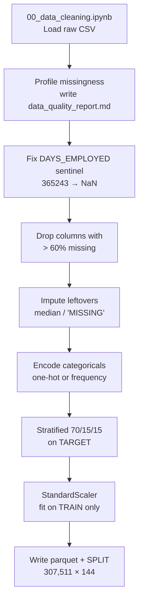
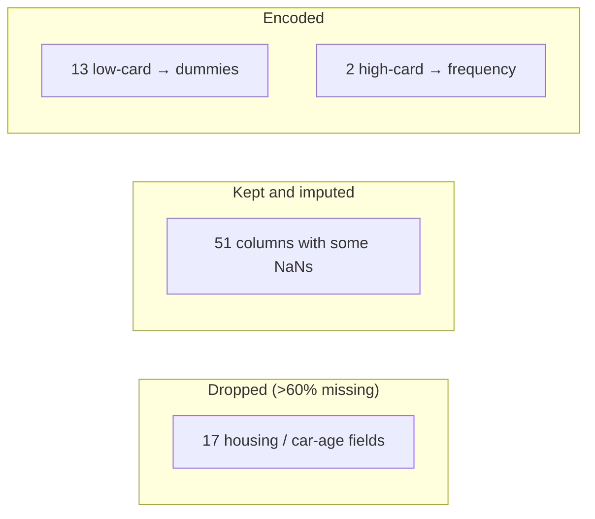
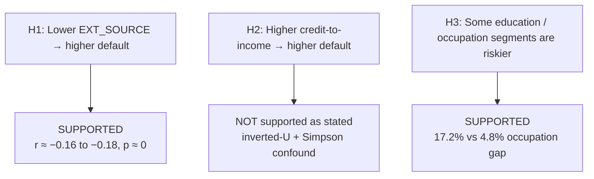
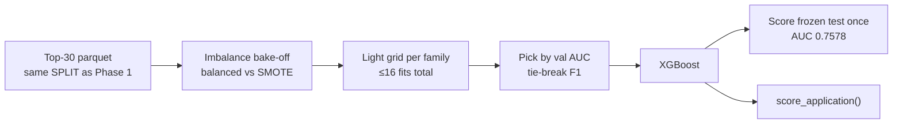
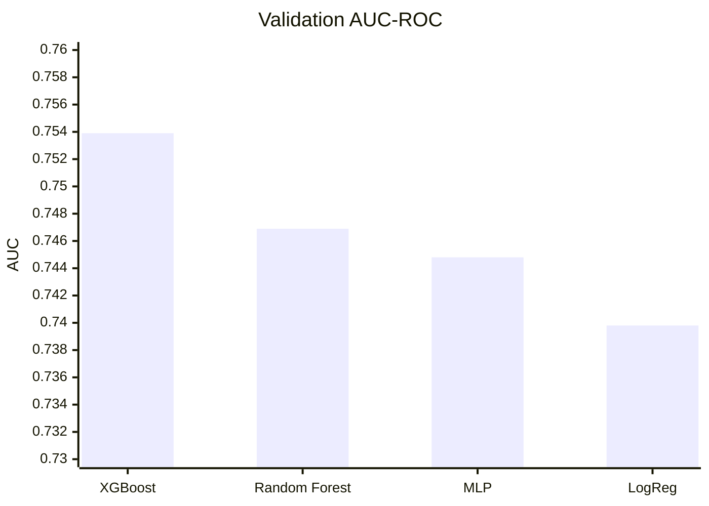

# Progress Update — How We Cleaned, Explored, and Modeled Credit Risk

**Course:** UIU Data Analytics Laboratory  
**Group:** DomainRange (Musfique Ahmed, Tasfiya Binte Karim)  
**Project:** Credit Risk Intelligence — Home Credit Default Risk (`application_train.csv` only)  
**Use this file tomorrow:** talk from the boxed “Say this” lines; use the tables if the teacher asks *why not X*.

---

## 30-second summary

We built an end-to-end default-forecasting pipeline on **307,511 loans × 122 raw columns**. After cleaning we have **144 columns**, a **stratified 70/15/15 split**, three hypothesis-driven EDA findings, a **top-30 feature set**, and a **4-model bake-off**. The winner is **XGBoost** (val AUC **0.7539**, test AUC **0.7578**), wrapped in a 3-way **Approve / Manual Review / Reject** scorer.

---

## 1. Data cleaning (Phase 1)

**Where it lives:** [`notebooks/00_data_cleaning.ipynb`](../notebooks/00_data_cleaning.ipynb) — this **is** the pipeline. Run All, top to bottom. Every step is a visible cell with a short “why / why not.”

`01_eda.ipynb` does **not** clean. It only **loads** the parquet this notebook writes.

**What the notebook writes:**

| Output | Path |
|---|---|
| Cleaned table | `data/processed/train_clean.parquet` (307,511 × 144) |
| Split masks | `data/processed/split_indices.npz` |
| Missingness profile | `reports/data_quality_report.md` |
| What we dropped / filled / encoded | `reports/cleaning_summary.md` |
| Missingness chart | `reports/figures/00_missingness_top20.png` |

`src/data/clean.py` is **not** how we clean the real CSV. It stays only so `tests/test_clean.py` can run the same rules on a tiny toy frame.

> **Say this:** “Cleaning is a full IPython notebook, not a hidden script. You can open `00_data_cleaning.ipynb` and see load → profile → sentinel → drop → impute → encode → split → train-only scale → save.”

### Notebook sections (what we show the teacher)

| § | Cell topic | What you see |
|---|---|---|
| 0 | Setup | Paths, 60% drop line, 10-unique encode cutoff, seed 42 |
| 1 | Load | Shape assert `(307511, 122)`, default rate **8.07%** |
| 2 | Profile | Top-20 missingness bar; red = drop, blue = keep; write quality report |
| 3 | Sentinel | 55,374 rows of `DAYS_EMPLOYED == 365243` → NaN |
| 4 | Drop | **17** columns with > 60% missing |
| 5 | Impute | Median / `'MISSING'`; leftover NaNs = 0 |
| 6 | Encode | 13 one-hot, 2 frequency |
| 7 | Split | Stratified 215,257 / 46,127 / 46,127 (same default rate in each) |
| 8 | Scale | `StandardScaler` fit on **train** only |
| 9–10 | Save + reload | Parquet + sanity: no NaNs, no leftover sentinel, train means ≈ 0 |

### What the raw data looks like

| Fact | Number | Why it matters |
|---|---|---|
| Rows × columns | 307,511 × 122 | Large enough for holdout + CV |
| Dtypes | 41 int, 65 float, 16 object | Need encoding, not just scaling |
| Default rate | **8.07%** (≈ 92/8 imbalance) | Accuracy would be a useless metric |
| Worst missingness | Housing fields ~66–70% | Cannot impute blindly |
| Known sentinel | `DAYS_EMPLOYED == 365243` in **55,374** rows | Fake “1,000-year job” if left as-is |

> **Say this:** “Cleaning is a coded pipeline with tests, not ad-hoc notebook edits. Same function can run on synthetic data in pytest and on the real CSV.”

### Pipeline (order matters)

| Step | What we did | Result |
|---|---|---|
| Sentinel | Replace 365243 with NaN | 55,374 rows fixed |
| Drop | Missing fraction **> 60%** | **17 columns** dropped (mostly `COMMONAREA_*`, `LIVINGAPARTMENTS_*`, `YEARS_BUILD_*`, `OWN_CAR_AGE`, …) |
| Impute | Numeric → **median**; categoricals → literal **`'MISSING'`** | 51 columns filled |
| Encode | ≤ 10 unique values → **one-hot** (`drop_first`); > 10 → **frequency** | 13 one-hot; `OCCUPATION_TYPE` and `ORGANIZATION_TYPE` frequency-encoded |
| Split | Stratified on `TARGET`, seed 42 | Train 215,257 / val 46,127 / test 46,127 |
| Scale | `StandardScaler` on numeric features | Fit **only** on the train mask (notebook prints train means ≈ 0; pytest guards the same rule on toy data) |

IDs and labels (`SK_ID_CURR`, `TARGET`, `SPLIT`) are **not** scaled.

### Why these choices — and what we refused

| Decision | We chose | We did **not** choose | Why not the alternative |
|---|---|---|---|
| Sentinel | Set 365243 to NaN, then impute with the rest | Leave it as a huge number, or drop those 55k rows | Leaving it would dominate any scale-sensitive model. Dropping 18% of applicants throws away a real “unemployed / unknown job” population. |
| Drop threshold | **60%** missing | 50% (too aggressive) or 80% / keep-all + fancy impute | Housing AVG/MODE/MEDI triples are mostly empty *and* redundant. Below ~60% we still have `LANDAREA_*` (~59%) which we kept. Above 60% we would keep columns that are mostly invented values. |
| Numeric impute | **Median** | Mean, KNN, iterative (MICE), drop rows | Income/credit are **long-tailed**; mean is pulled by outliers. KNN/MICE are slow on 300k×100+ and leak if fit on all rows. Dropping rows would bias toward “complete” applicants. |
| Categorical impute | Explicit **`'MISSING'`** category | Mode fill, or drop | Mode pretends “we know the occupation.” Missingness itself can be a signal (e.g. people who skip housing fields). |
| Low-card encoding | **One-hot** | Label / ordinal encoding | Education *is* ordinal, but most other fields (gender, housing type, weekday) are not. One-hot does not invent a false order. `drop_first` avoids the dummy-variable trap for linear models. |
| High-card encoding | **Frequency** (`OCCUPATION_TYPE`, `ORGANIZATION_TYPE`) | One-hot everything, or target encoding | One-hot would explode column count (organization has dozens of types). Target encoding needs careful CV to avoid leakage; frequency uses **target-independent** counts, which is safer at this stage. |
| Split | **Stratified** 70/15/15 | Random split, or 80/20 only | Random split can starve the test set of defaults (~8%). We need **val** for model pick and a **frozen test** for the final number. |
| Scaling | Train-only `StandardScaler` | Scale the whole table first, or skip scaling | Scaling before split leaks val/test means into train. Trees don’t need scaling, but **LR and the MLP do**; one shared scaled table keeps the four models comparable. |
| Scope | `application_train.csv` only | Bureau, previous apps, credit card tables | Course brief: application table only. Extra tables would be a different project. |

---

## 2. EDA (Phase 2)

**Where it lives:** `notebooks/01_eda.ipynb` (built by `notebooks/_build_eda_notebook.py`).  
**Write-up:** `reports/eda_findings.md`.  
**Charts:** `reports/figures/01_*.png` … `12_*.png`.

### How we explored (not “plot everything”)

We used **two tables on purpose**:

- **`df_raw`** — original categoricals, sentinel-aware employment plots.
- **`df_clean`** — post-imputation numerics / heatmap (so missingness does not punch holes in correlations).

| Section | What we looked at | Typical chart |
|---|---|---|
| Univariate | Target, income, credit, age, employment | Histograms; **log scale** on income/credit because they are long-tailed |
| Bivariate | Credit-to-income vs default | Default rate by CTI **decile** |
| H1 | Three bureau scores `EXT_SOURCE_1/2/3` | Score vs default + Pearson *r* |
| Employment / income | Risk along those axes | Grouped rates |
| H3 | Education, occupation, contract | Default rate + 95% CI error bars |
| Heatmap | Top-25 numerics vs `TARGET` | Correlation matrix on **cleaned** data |
| Formal tests | Three pre-registered hypotheses | Pearson, logistic with confounder, χ² + Cramér’s V |

> **Say this:** “EDA is hypothesis-driven. We did not just dump 122 histograms. We asked three business questions and were willing to **reject** one of them.”

### Three hypotheses (this is the EDA story)

**H1 — bureau scores (Pearson correlation)**  
All three `EXT_SOURCE_*` scores are negatively correlated with default. Univariate AUC of the mean score is about **0.65** — useful, but not enough alone.  
**Business line:** `EXT_SOURCE_3` should be a **required** application field.

**H2 — credit-to-income (deciles + logistic, then add `EXT_SOURCE_3`)**  
Naive story (“more leverage → more default”) is **wrong as a simple rule**. Default rate is an **inverted U**: peaks at **9.2%** in decile 6, falls to **7.1%** at the top. When we add `EXT_SOURCE_3` to the regression, the CTI coefficients **flip sign** — high-CTI applicants are also high-income / high-bureau-score. That is Simpson’s paradox.  
**Business line:** do **not** use a raw CTI cutoff; let a multivariate model handle it.

**H3 — segments (χ² + Cramér’s V)**  
Low-skill laborers **17.2%** vs accountants **4.8%** (about **3.5×**). Education is monotonic: lower secondary **10.9%** → academic degree **1.8%**. Tests are significant (p ≪ 10⁻²⁰⁰) but **effect sizes are small** (Cramér’s V ≈ 0.03–0.08).  
**Business line:** segments are real, but they are **not** a standalone underwriting rule.

### Why these EDA methods — and what we refused

| Decision | We chose | We did **not** choose | Why not |
|---|---|---|---|
| Structure | 3 hypotheses + effect sizes | Undirected “100 plots” EDA | A teacher (and a lender) care about *decisions*, not chart volume. |
| H1 metric | **Pearson *r*** + p-value | Only a bar chart, or Spearman only | We need a number we can defend. Spearman would be similar; Pearson is the standard first report for a roughly linear bureau-score effect. |
| H2 check | Decile default rates **and** a regression that adds `EXT_SOURCE_3` | Stop at a single correlation | Correlation would have been weak/misleading. The **shape** (inverted-U) and the **confounder** are the finding. |
| H3 metric | **χ²** + **Cramér’s V** | Only p-values, or one-way ANOVA on dummy codes | p-values explode with n = 307k. V tells us the association is **statistically huge but practically small**. |
| Scales | Log income/credit | Linear axes | Linear histograms hide the body of the distribution in one bar. |
| Employment plots | Drop sentinel **on raw data** for the histogram | Plot 365243 as ~1000 years | That spike is a data-entry code, not a job length. |
| Heatmap | Cleaned, imputed numerics | Raw matrix with pairwise deletion only | Pairwise deletion changes *n* per cell and mixes missingness patterns. |
| Causality | Observational language | “EXT_SOURCE *causes* default” | We never randomized bureau scores. |

If the PNGs are on disk, these are the slides:

| Figure | File |
|---|---|
| Class imbalance | `reports/figures/01_target_balance.png` |
| Income / credit tails | `02_income_distribution.png`, `03_credit_distribution.png` |
| Age / employment | `04_age_distribution.png`, `05_employment_length_distribution.png` |
| CTI inverted-U | `06_default_vs_cti.png` |
| EXT_SOURCE | `07_ext_source_vs_default.png` |
| Education / occupation / contract | `08`–`10_*.png` |
| Correlation heatmap | `11_correlation_heatmap.png` |
| Employment × income | `12_employment_income_vs_risk.png` |

---

## 3. Features before modeling (Phase 3 — needed to explain the models)

We did not throw 144 columns into the final models.

**7 engineered columns** (`src/features/engineer.py`):

| Feature | Formula (idea) | Why |
|---|---|---|
| `AGE_YEARS` | −`DAYS_BIRTH` / 365.25 | Human units; same signal as days |
| `EMPLOYED_YEARS` | −`DAYS_EMPLOYED` / 365.25 | Same |
| `CREDIT_INCOME_RATIO` | credit / income | Leverage (H2) |
| `ANNUITY_INCOME_RATIO` | annuity / income | Debt service |
| `CREDIT_GOODS_RATIO` | credit / goods price | How much they borrowed vs purchase |
| `INCOME_PER_FAM_MEMBER` | income / family size | Household affordability |
| `EXT_SOURCE_MEAN` | mean of 3 scores, skip NaNs | H1 — keep the best aggregate visible to feature selection |

Safe divide → NaN if denominator ≤ 0 (no fake zeros).

**Top-30 selection** = mean of three ranks: **XGBoost importance**, **Random Forest importance**, **SHAP** (TreeSHAP on a 5k-row sample). We did **not** use a single importance list (trees disagree; SHAP is a different question: contribution vs split gain).

**Sanity check (5-fold CV, logistic regression):**

| Feature set | CV AUC |
|---|---|
| All features | **0.7445 ± 0.0026** |
| Top-30 | **0.7397 ± 0.0023** |

Gap ≈ **0.005**. We kept **top-30** so the dashboard form is usable and noise columns do not dominate.

**Why not** PCA, RFE-only, or mutual information alone? PCA destroys named features (bad for a credit explainer). A single wrapper method is unstable. MI ignores interactions that trees/SHAP see.

Top 5 by mean rank: `EXT_SOURCE_MEAN`, `EXT_SOURCE_1`, `EMPLOYED_YEARS`, `EXT_SOURCE_3`, `CODE_GENDER_M`.

---

## 4. ML models (Phase 4)

**Where it lives:** `src/models/` + `notebooks/03_model_building.ipynb`.  
**Table:** `reports/phase4_model_comparison.md`.  
**Charts:** `reports/figures/17_*.png` … `23_*.png`.

### Why four families (and not four variants of the same tree)

The brief asked for **4+ ML/DL models**. We picked **different assumptions**, not four XGBoosts:

| Model | Role | Why this one |
|---|---|---|
| **Logistic regression** | Interpretable linear baseline | If trees cannot beat a linear model by much, we should not ship a black box. |
| **Random Forest** | Bagged trees | Strong default tabular baseline; native NaNs; second importance vote. |
| **XGBoost** | Gradient boosting | Usual winner on tabular credit data. **Not LightGBM** — same job, but XGB matches the sklearn-style API we already used in Phase 3. |
| **MLP (PyTorch)** | Deep learning slot | **Not TensorFlow** — no Python 3.14 wheels in our environment. Architecture: hidden `[128, 64]`, dropout 0.3, early stopping. |

> **Say this:** “Four *families*, one shared metric card, one frozen test set. The winner is chosen on **validation AUC**, then we look at test once.”

### Class imbalance: we actually A/B tested it

~8% defaults. Options we **ran**, not just discussed:

| Family | `class_weight` / `scale_pos_weight` | SMOTE (k=5, inside a pipeline) |
|---|---:|---:|
| Logistic regression | **0.7398** | 0.7394 |
| XGBoost | **0.7539** | **0.7203** |

**SMOTE lost**, badly on XGBoost. Synthetic minorities in this feature space hurt ranking quality. We kept **`balanced` / `scale_pos_weight = neg/pos ≈ 11.39`**. MLP used **`pos_weight`** in the loss (same idea).

**Why not undersample the majority?** We would throw away ~180k good-payer rows. **Why not only accuracy?** A dummy “always approve” model is already ~92% accurate.

### Primary metric: AUC-ROC (not F1-first)

| Metric | We use it for | We do **not** use it as the winner rule |
|---|---|---|
| **AUC-ROC** | Model ranking (threshold-free) | — |
| Precision / recall / F1 / confusion | Operating point at threshold **0.50** | Winner pick (F1 is threshold-sensitive and noisy at 8% prevalence) |
| Youden’s J | Available in `evaluate.pick_threshold` | Final table stayed at **0.50** for a fair 4-way compare |

Credit ranking (“who is riskier?”) is an AUC problem. The **policy** (approve vs review vs reject) is a separate threshold layer.

### Validation results (same val set)

| Model | Val AUC | Precision | Recall | F1 | Notes |
|---|---:|---:|---:|---:|---|
| **XGBoost** | **0.7539** | 0.164 | **0.675** | 0.264 | `n_estimators=300`, `max_depth=4`, `lr=0.05` |
| Random Forest | 0.7469 | **0.237** | 0.394 | **0.296** | Higher F1, **misses more defaulters** (recall 0.39) |
| MLP | 0.7448 | 0.153 | 0.688 | 0.250 | Close to RF; more compute, less interpretability |
| Logistic regression | 0.7398 | 0.156 | 0.660 | 0.252 | `C=10`; surprisingly close — linear signal is real |

**Test (winner only):** AUC **0.7578**. Val→test gap is **+0.004** — not overfit.

> **If asked “why not ship Random Forest? It has the best F1.”**  
> RF’s F1 is higher because it is more conservative (precision 0.237, recall 0.394). In credit risk, **missing a default (FN)** is usually costlier than extra reviews. XGBoost’s recall **0.675** and best AUC make it the ranking + catch-default model. The gray zone is handled by **Manual Review**, not by maximizing F1.

### Why we did not use other popular methods

| Alternative | Why we skipped it |
|---|---|
| LightGBM / CatBoost | Same boosting family as XGB; extra library, little extra story |
| SVM | Slow at 215k rows; kernel SVMs do not scale here |
| k-NN | Distance in 30-D after mixed encodings is weak; no probability calibration story |
| Naive Bayes | Independence assumption fails on correlated amounts / EXT_SOURCE |
| Huge Optuna / 100-trial search | Brief budget: **light grid** (C ∈ {0.1,1,10}, small XGB/RF/MLP grids). More search would be homework, not a new method. |
| Train on all features in Phase 4 | Phase 3 already showed top-30 ≈ all-features. Dashboard needs 30 named inputs. |
| Single 0/1 cutoff as the product | Business needs a **human-in-the-loop** band |

### What we ship

`src/models/score.py` → `score_application(features) → {probability_of_default, recommendation}`

| Probability of default *p* | Action |
|---|---|
| *p* < 0.20 | **Approve** |
| 0.20 ≤ *p* < 0.50 | **Manual Review** |
| *p* ≥ 0.50 | **Reject** |

Demo profiles from the notebook: low-risk *p* ≈ 0.007 → Approve; mid *p* ≈ 0.39 → Review; high *p* ≈ 0.95 → Reject.

ROC overlay and confusion matrices: `reports/figures/22_roc_overlay_4models.png`, `23_confusion_matrices.png`. Imbalance A/B: `17_imbalance_compare.png`.

---

## 5. How the three phases connect (one paragraph)

`00_data_cleaning.ipynb` **protects later science**: sentinel values do not become fake 1,000-year jobs; the scaler never sees val/test; missingness is either dropped or labeled, not silently “averaged away.” `01_eda.ipynb` **tells us what to engineer** (`EXT_SOURCE_MEAN`, credit ratios) and what **not** to trust as a rule (raw CTI). Modeling **tests** those ideas under a fair split: class weights beat SMOTE, top-30 is enough, XGBoost wins on ranking and default recall, and a 3-way policy absorbs the 8% base-rate problem that a single threshold cannot.

---

## 6. Honest limits (say these if asked)

1. **Observational data** — no causal claim that raising EXT_SOURCE “causes” fewer defaults.  
2. **Application table only** — bureau/previous-loan tables are out of scope.  
3. **No chat “AI agent”** — the deployable piece is `score_application()`, not an LLM.  
4. **Small H3 effect sizes** — occupation/education rules alone are not a model.  
5. **Precision is low at 0.50** (~0.16 for XGB) because defaults are rare; that is why **Manual Review** exists.

---

## 7. Suggested speaking order (~8–10 minutes)

1. Problem + 8% default + 122 messy columns.  
2. Open the story of `00_data_cleaning.ipynb` (not a `.py` cleaner): profile → sentinel → 60% drop → median/`MISSING` → encode → stratified split → **train-only** scaler.  
3. One rejected idea (mean impute, or drop 55k sentinel rows).  
4. H1 supported, **H2 rejected**, H3 supported-but-small-V (`01_eda.ipynb`).  
5. Top-30 almost matches all-features AUC.  
6. Four families; SMOTE lost; XGBoost 0.75 / 0.76; 3-way policy.  
7. Dashboard exists if they want a demo (`streamlit run dashboard/app.py`).

---

## Pointers if they ask “where is the code?”

| Topic | Path |
|---|---|
| Cleaning notebook (run this) | `notebooks/00_data_cleaning.ipynb` |
| Cleaning reports | `reports/cleaning_summary.md`, `reports/data_quality_report.md` |
| EDA notebook | `notebooks/01_eda.ipynb` |
| Feature engineering / select | `src/features/engineer.py`, `src/features/select.py` + `notebooks/02_feature_selection.ipynb` |
| Train / tune / metrics / score | `src/models/` + `notebooks/03_model_building.ipynb` |
| Tests (toy-data clone of cleaning rules) | `tests/test_clean.py` (plus engineer / score / dashboard — 23 total) |
| Longer inventory doc | `docs/PROJECT_DOCUMENTATION.md` |
