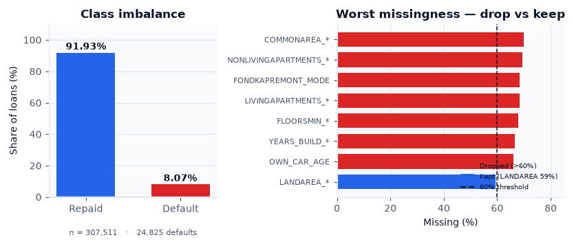
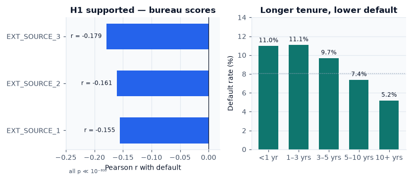
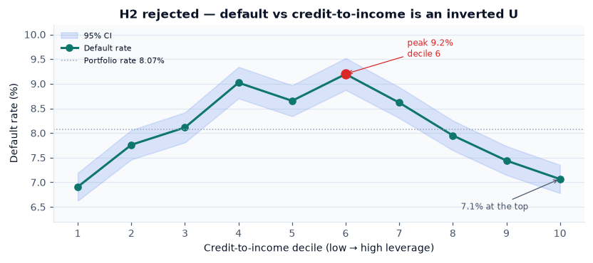
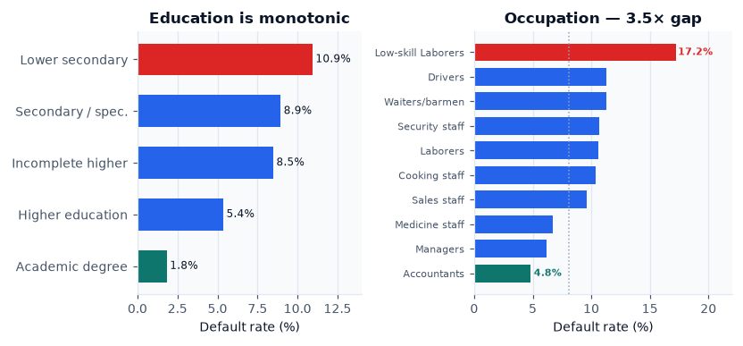
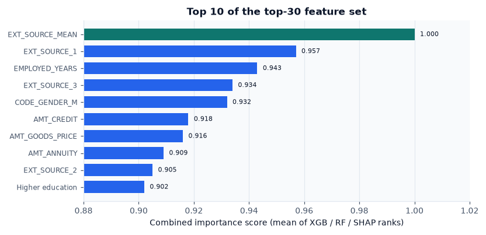
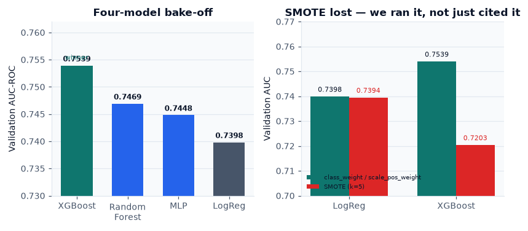
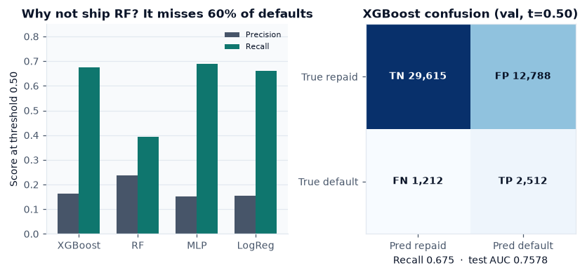
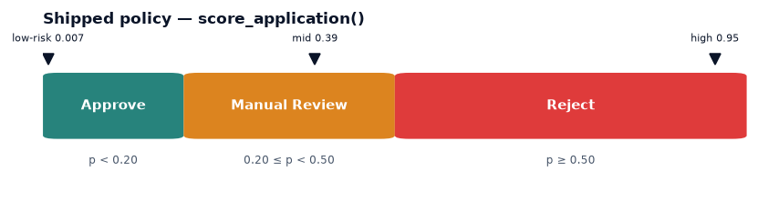

# Credit Risk Intelligence — Progress Update

**Course:** UIU Data Analytics Laboratory
**Group:** DomainRange (Musfique Ahmed, Tasfiya Binte Karim)
**Date:** 8 September 2026
**Dataset:** Home Credit Default Risk — `application_train.csv` only (307,511 loans × 122 columns)
**Today's scope:** data cleaning → exploratory analysis → model implementations

> Present from the PDF. Charts below are the evidence — you do not need to open notebooks. Each numbered section is one talking block. The **Say this** line is the spoken opener. Total runtime about 10–12 minutes.

---

## 1. Where we stand

We built an end-to-end default-forecasting pipeline on **307,511 loans**. After cleaning we work with **144 columns** on a frozen stratified **70 / 15 / 15** split. EDA produced three formally tested hypotheses. Feature work reduced the space to a **top-30** set. A four-model bake-off picked **XGBoost** at **validation AUC 0.7539** and **test AUC 0.7578**. The model is wrapped in a three-way **Approve / Manual Review / Reject** scorer.

| Phase | What we delivered | Status |
|---|---|---|
| 1 — Cleaning | `notebooks/00_data_cleaning.ipynb` → `train_clean.parquet` (307,511 × 144) | Done |
| 2 — EDA | `notebooks/01_eda.ipynb` → 3 hypothesis tests + 12 figures | Done |
| 3 — Features | 7 engineered columns → top-30 set (gap vs all-features: 0.0048 AUC) | Done |
| 4 — Models | Logistic Regression, Random Forest, XGBoost, PyTorch MLP | Done |
| 5 — Product | `score_application()` + 4-tab Streamlit dashboard | Done |
| Tests | 23 pytest checks across cleaning, features, scoring, dashboard | Passing |

**Say this:** “The pipeline is complete end to end. I’ll walk through the three parts for today — how we cleaned the data, what the exploration found, and how the four models were implemented and compared.”

---

# Part I — Data Cleaning

## 2. What the raw data looked like

Before deciding anything we profiled the file. Three problems drove every later choice.

| Property | Value | Why it matters |
|---|---|---|
| Shape | 307,511 rows × 122 columns | Large enough for a real holdout *and* cross-validation |
| Data types | 41 integer, 65 float, 16 object | Encoding is required, not just scaling |
| Default rate | **8.07%** (24,825 defaults vs 282,686 repaid) | ~92 / 8 imbalance — accuracy is a useless metric |
| Worst missingness | Housing fields at **66–70%** empty | Cannot be imputed honestly |
| Hidden sentinel | `DAYS_EMPLOYED == 365243` in **55,374** rows | Encodes “unemployed”; reads as a 1,000-year job if left alone |

**Say this:** “The headline problem is not size, it is honesty of the values. Eight percent of applicants default, seventeen columns are two-thirds empty, and fifty-five thousand rows carry a placeholder that would look like a thousand-year employment history.”

---

## 3. The cleaning pipeline — order matters

Cleaning lives in a visible notebook, `notebooks/00_data_cleaning.ipynb`, not a hidden script. It runs top to bottom. The same rules exist as functions in `src/data/clean.py` so `tests/test_clean.py` can replay them on a tiny toy frame.

| Step | What we did | Result |
|---|---|---|
| 1. Load | Assert shape `(307511, 122)` | Default rate confirmed at 8.07% |
| 2. Profile | Write missingness report; flag drop vs keep | `reports/data_quality_report.md` |
| 3. Sentinel | Replace `DAYS_EMPLOYED == 365243` with NaN | **55,374** rows corrected |
| 4. Drop | Remove columns with **> 60%** missing | **17** columns dropped |
| 5. Impute | Numeric → column **median**; categorical → literal **`'MISSING'`** | **51** columns filled |
| 6. Encode | ≤ 10 unique values → one-hot (`drop_first`); > 10 → frequency | **13** one-hot, **2** frequency |
| 7. Split | Stratified on `TARGET`, seed 42 | Train 215,257 / val 46,127 / test 46,127 |
| 8. Scale | `StandardScaler` on numeric features | Fit on the **train mask only** |
| 9. Save | Parquet + split indices + sanity checks | 307,511 × **144** columns, zero leftover NaNs |

The seventeen dropped columns are almost entirely the housing AVG / MODE / MEDI triples — `COMMONAREA_*` at 69.9%, `NONLIVINGAPARTMENTS_*` at 69.4%, `LIVINGAPARTMENTS_*` at 68.4%, `FLOORSMIN_*` at 67.9%, `YEARS_BUILD_*` at 66.5% — plus `FONDKAPREMONT_MODE` at 68.4% and `OWN_CAR_AGE` at 66.0%. We kept `LANDAREA_*` at 59.4%, just under the cut.

One-hot columns: contract type, gender, car/realty flags, suite, income type, education, family status, housing type, weekday, house type, wall material, emergency state. Frequency-encoded: `OCCUPATION_TYPE` and `ORGANIZATION_TYPE`. IDs and labels (`SK_ID_CURR`, `TARGET`, `SPLIT`) are never scaled.

**Say this:** “The order is deliberate. Fix the sentinel before imputing, or the median gets poisoned. Drop before imputing, or we invent values for columns we are about to delete. Split before scaling, so the scaler never sees validation or test data.”

---

## 4. Cleaning decisions we can defend

Every choice had a rejected alternative. These are the ones most likely to be challenged.

| Decision | We chose | We rejected | Why |
|---|---|---|---|
| Sentinel | Set 365243 to NaN, then impute with the rest | Leave it as a huge number, or delete the 55,374 rows | Leaving it dominates any scale-sensitive model. Deleting it throws away 18% of applicants who are genuinely unemployed — a real, risky population. |
| Drop threshold | **60%** missing | 50% (too aggressive) or 80% / keep-all + fancy impute | Housing triples are both empty *and* redundant. At 60% we still keep `LANDAREA_*`. Above 60% we would be modelling on invented numbers. |
| Numeric impute | **Median** | Mean, KNN, MICE, drop rows | Income and credit are long-tailed, so the mean is dragged by outliers. KNN / MICE are slow at 300k × 100+ and leak if fitted on all rows. Dropping rows biases toward “complete” applicants. |
| Categorical impute | Explicit **`'MISSING'`** category | Mode fill | Mode pretends we know the occupation. Missingness itself is a signal. |
| Low-card encoding | **One-hot** (`drop_first`) | Label / ordinal encoding | Education is ordinal, but gender, housing type, and weekday are not. One-hot does not invent a false order. |
| High-card encoding | **Frequency** | One-hot everything, or target encoding | One-hot on `ORGANIZATION_TYPE` explodes column count. Target encoding needs careful CV to avoid leakage; frequency uses target-independent counts. |
| Split | **Stratified** 70 / 15 / 15 | Random split, or 80 / 20 with no val set | A random split can starve the test set of the 8% minority. We need val to pick the model and a frozen test for the final number. |
| Scaling | Train-only `StandardScaler` | Scale the whole table first, or skip scaling | Scaling before the split leaks val/test means into train. Trees do not need scaling, but logistic regression and the MLP do; one shared scaled table keeps the four models comparable. |
| Scope | `application_train.csv` only | Bureau, previous apps, credit-card tables | Course brief: application table only. Extra tables would be a different project. |

Verification: `tests/test_clean.py` asserts the three critical rules on a toy frame — the sentinel becomes NaN, columns above 60% missing disappear, and the scaler is fitted on the train slice only. The notebook itself ends with sanity checks: no NaNs remain, no sentinel survives, train means ≈ 0.

**Say this:** “If you take one thing from cleaning: the median-versus-mean choice and the train-only scaler are the two decisions that protect everything downstream.”

---

# Part II — Exploratory Data Analysis

## 5. How we explored — hypothesis-driven, not chart-driven

We did not plot 122 histograms. We pre-registered three business questions and were willing to reject any of them. We also used **two tables on purpose**:

- `df_raw` — original categoricals and sentinel-aware employment plots
- `df_clean` — post-imputation numerics / heatmap, so missingness does not punch holes in correlations

| Section | What we examined | Method |
|---|---|---|
| Univariate | Target, income, credit, age, employment | Histograms; **log scale** on income and credit (long tails) |
| Bivariate | Credit-to-income vs default | Default rate by CTI **decile** with 95% CI |
| H1 | Three bureau scores `EXT_SOURCE_1/2/3` | Pearson *r* + p-value |
| H2 | Leverage | Decile shape, then logistic regression with a confounder added |
| H3 | Education, occupation, contract type | χ² test + Cramér’s V effect size |
| Multivariate | Top-25 numerics vs `TARGET` | Correlation heatmap on **cleaned** data |

**Say this:** “Volume of charts is not evidence. We asked three questions a lender would actually pay for, tested each one formally, and reported effect sizes — not just p-values, which explode at n = 307,000.”

---

## 6. Finding 1 — bureau scores (SUPPORTED)

**H1 — lower `EXT_SOURCE` → higher default.**

All three `EXT_SOURCE_*` scores correlate negatively with default at **r ≈ −0.16 to −0.18**, p ≪ 10⁻²⁰⁰. The mean of the three scores reaches a univariate AUC of about **0.65** on its own — useful, but nowhere near enough alone.

**Business line:** `EXT_SOURCE_3` should be a **required** field on every application.

**Say this:** “External bureau data is the strongest single signal in this table. It is not a model by itself — 0.65 AUC leaves a lot of residual risk — but any later feature set that drops these scores is leaving money on the table.”

---

## 7. Finding 2 — the hypothesis we rejected

**H2 — higher credit-to-income means higher default. NOT SUPPORTED as stated.**

The naive story fails in two separate ways.

1. **The shape is wrong.** Default rate against CTI is an **inverted U**: it peaks at **9.2%** in decile 6 and *falls* to **7.1%** in the top decile. The most leveraged applicants are not the riskiest.
2. **A confounder explains it.** Adding `EXT_SOURCE_3` to the logistic regression **flips the sign** of the CTI coefficient. High-CTI applicants are also high-income and high-bureau-score. That is Simpson’s paradox.

**Business line:** do **not** ship a raw credit-to-income cutoff. Let a multivariate model handle the interaction.

**Say this:** “This is the finding I would defend hardest, because a rejected hypothesis is worth more than a confirmed one here. If we had stopped at a single correlation we would have shipped a leverage cutoff that penalises exactly the applicants who repay.”

---

## 8. Finding 3 — segments are real, but small (SUPPORTED)

**H3 — some education / occupation segments are riskier.**

| Segment | Default rate |
|---|---|
| Low-skill labourers | **17.2%** |
| Accountants | **4.8%** |
| Gap | about **3.5×** |
| Lower secondary education | **10.9%** |
| Academic degree | **1.8%** |

All three χ² tests are significant at p ≪ 10⁻²⁰⁰, but **Cramér’s V is only 0.03–0.08**. Statistically certain, practically weak.

**Business line:** segments are real and defensible as an adjunct, but they are **not** a standalone underwriting rule.

**Say this:** “H3 is the honest one. The p-value is astronomically small and the effect size is tiny — both are true at once. That is exactly why we report Cramér’s V.”

---

## 9. From EDA to features (needed to explain the models)

The exploration told us what to build. Seven engineered features live in `src/features/engineer.py`. Safe divide returns NaN rather than a fake zero whenever the denominator is ≤ 0.

| Feature | Definition | Motivated by |
|---|---|---|
| `EXT_SOURCE_MEAN` | Mean of the three bureau scores, skipping NaNs | H1 |
| `CREDIT_INCOME_RATIO` | Credit ÷ income | H2 (keep it for the model, not as a cutoff) |
| `ANNUITY_INCOME_RATIO` | Annuity ÷ income | Debt-service capacity |
| `CREDIT_GOODS_RATIO` | Credit ÷ goods price | Borrowing above purchase value |
| `INCOME_PER_FAM_MEMBER` | Income ÷ family size | Household affordability |
| `AGE_YEARS` | −`DAYS_BIRTH` ÷ 365.25 | Human-readable units |
| `EMPLOYED_YEARS` | −`DAYS_EMPLOYED` ÷ 365.25 | Human-readable units |

That gives **148** candidate features. We ranked them by the **mean of three independent votes** — XGBoost gain, Random Forest importance, and TreeSHAP on a 5,000-row sample — rather than trusting a single list. Then we kept the **top 30**.

| Feature set | 5-fold CV AUC (logistic regression) |
|---|---|
| All 148 features | **0.7445 ± 0.0026** |
| Top 30 | **0.7397 ± 0.0023** |

The gap is **0.0048 AUC**. We pay half a point for a five-fold smaller feature space, a usable dashboard form, and less noise.

Top five by mean rank: `EXT_SOURCE_MEAN`, `EXT_SOURCE_1`, `EMPLOYED_YEARS`, `EXT_SOURCE_3`, `CODE_GENDER_M`. `EXT_SOURCE_MEAN` ranks **first on all three methods at once**.

We did not use PCA (it destroys named features, which a credit explainer needs), RFE-only (unstable), or mutual information alone (it ignores the interactions that trees and SHAP see).

**Say this:** “Note that `EXT_SOURCE_MEAN` — a feature EDA told us to build — ranks first on all three importance methods simultaneously. That is the EDA paying for itself.”

---

# Part III — Model Implementations

## 10. Four families, not four variants of one tree

The brief asked for four or more ML / DL models. We chose four **different sets of assumptions**, so the comparison is informative rather than decorative. All four train on the **same top-30 features** and the **same frozen split** from Phase 1.

| Model | Family | Role | Implementation |
|---|---|---|---|
| **Logistic regression** | Linear | Interpretable baseline | `sklearn` Pipeline: median impute → `StandardScaler` → LR (`solver=lbfgs`, `max_iter=200`). If trees cannot clearly beat this, we should not ship a black box. |
| **Random Forest** | Bagged trees | Strong tabular default | 300 trees, `min_samples_leaf=20`, `class_weight='balanced_subsample'`. Native NaNs. Also supplies the second importance vote in Phase 3. |
| **XGBoost** | Gradient boosting | Usual winner on tabular credit data | `tree_method='hist'`, `scale_pos_weight = neg/pos ≈ 11.39`. Chosen over LightGBM / CatBoost because it is the same boosting family with no extra story. |
| **MLP (PyTorch)** | Deep learning | The DL slot | Hidden `[128, 64]`, ReLU, dropout 0.3, one logit, `BCEWithLogitsLoss` with `pos_weight`. Early stopping on val AUC, patience 3. PyTorch rather than TensorFlow — no Python 3.14 wheels. |

Code lives in `src/models/`: `train.py` (one `train_*` per family), `tune.py` (light grids), `mlp.py` (network + sklearn-style wrapper), `evaluate.py` (shared metric card), `score.py` (production API).

**Say this:** “Four families, one shared metric card, one frozen test set. The winner is chosen on validation AUC, then we look at test once.”

---

## 11. How each model is actually trained

### Shared protocol

- Same `X_tr` / `X_val` / `X_te` from the Phase 1 split masks.
- Winner picked on **validation AUC**; ties broken by F1.
- Precision / recall / F1 / confusion reported at a **fixed threshold of 0.50** so the four-way comparison is fair.
- Light grid, **≤ 16 fits total** across all families — not a 100-trial Optuna search.

| Family | Grid |
|---|---|
| Logistic regression | `C ∈ {0.1, 1, 10}` |
| Random Forest | `max_depth ∈ {8, 12, None}`, `n_estimators` fixed at 300 |
| XGBoost | `max_depth ∈ {4, 6}` × `learning_rate ∈ {0.05, 0.1}`, 300 trees |
| MLP | hidden `(64, 32)` vs `(128, 64)`; dropout 0.3, lr 0.001, batch 2048, max 12 epochs |

### Logistic regression — linear baseline

Logistic regression cannot accept NaN, and three engineered ratios are NaN when the denominator is zero. The pipeline therefore **imputes median on the train slice**, then scales, then fits. `class_weight='balanced'` reweights the 8% minority. Best config: **C = 10**.

### Random Forest — bagged trees

No extra scaler. `class_weight='balanced_subsample'` reweights inside each bootstrap sample. `min_samples_leaf=20` stops the trees from memorising rare defaults. Best config: **300 trees, unlimited depth**. We did not run SMOTE on RF — class weighting already does the same job more simply.

### XGBoost — gradient boosting (winner)

`scale_pos_weight = n_neg / n_pos = 11.387` on the train labels. Histogram tree method for 215k rows. SMOTE was A/B tested (see next section) and lost. Best config: **`n_estimators=300`, `max_depth=4`, `learning_rate=0.05`**. Shallow trees plus a small learning rate beat deeper / faster settings on this table.

### MLP — PyTorch feed-forward net

Architecture: `Linear → ReLU → Dropout` repeated for each hidden width, then a single logit. We do **not** use `DataLoader` — at 215k × 30 floats the Python overhead dominates, so we materialise one train tensor and slice minibatches. Loss is `BCEWithLogitsLoss` with `pos_weight ≈ 11.39` (same idea as XGBoost’s scale). A `StandardScaler` is fit on train only and stored inside `MLPWrapper`, which exposes `predict_proba` so the rest of the pipeline treats it like any sklearn classifier. Best run: hidden **`[128, 64]`**, dropout **0.3**, best epoch **11**.

### What we skipped, and why

| Alternative | Why we skipped it |
|---|---|
| LightGBM / CatBoost | Same boosting family as XGBoost; extra library, little extra story |
| SVM | Kernel methods do not scale to 215k rows |
| k-NN | Distance in 30-D after mixed encodings is weak; no probability story |
| Naive Bayes | Independence assumption fails on correlated amounts and `EXT_SOURCE` |
| Huge Optuna search | More homework, not a new method |
| Train on all 148 features in Phase 4 | Phase 3 already showed top-30 ≈ all-features; the dashboard needs 30 named inputs |

---

## 12. Class imbalance — we A/B tested it, not just discussed it

At 8% defaults, imbalance handling is a real decision. We ran both options and measured **validation AUC**.

| Family | `class_weight` / `scale_pos_weight` | SMOTE (k = 5, inside a pipeline) |
|---|---:|---:|
| Logistic regression | **0.7398** | 0.7394 |
| XGBoost | **0.7539** | 0.7203 |

**SMOTE lost — badly on XGBoost, by 3.4 AUC points.** Synthetic minority samples in this feature space damage ranking quality. SMOTE was wrapped *inside* an `imblearn` pipeline (impute → SMOTE → estimator) so synthetic rows never touched validation. The comparison chart is in the results section below.

We kept:

- Logistic regression / Random Forest → `class_weight='balanced'`
- XGBoost → `scale_pos_weight = 11.387`
- MLP → equivalent `pos_weight` in the loss

We also rejected **undersampling the majority**, which would throw away roughly 180,000 good-payer rows, and we refused **accuracy** as a metric — a model that approves everyone is already 92% accurate.

**Say this:** “SMOTE is the textbook answer and it lost. That is why we ran it instead of citing it.”

---

## 13. Results — XGBoost wins on ranking and on catching defaults

Primary metric is **AUC-ROC** because credit risk is a ranking problem — who is riskier than whom — and AUC is threshold-free. F1 is threshold-sensitive and noisy at 8% prevalence, so it is reported as an operating point, not the winner rule.

| Model | Val AUC | Precision | Recall | F1 | Best config |
|---|---:|---:|---:|---:|---|
| **XGBoost** | **0.7539** | 0.164 | **0.675** | 0.264 | 300 trees, depth 4, lr 0.05 |
| Random Forest | 0.7469 | **0.237** | 0.394 | **0.296** | 300 trees, unlimited depth |
| MLP (PyTorch) | 0.7448 | 0.153 | 0.688 | 0.250 | hidden [128, 64], dropout 0.3, epoch 11 |
| Logistic regression | 0.7398 | 0.156 | 0.660 | 0.252 | C = 10 |

All of those precision / recall / F1 numbers are at threshold **0.500**.

**Test set, winner only: AUC 0.7578.** The validation-to-test gap is **+0.004**, so we are not overfitting — and we touched the test set exactly once.

XGBoost confusion on val at 0.50: TN 29,615 / FP 12,788 / FN 1,212 / TP 2,512. It catches about two-thirds of defaulters; the cost is extra false positives, which the review band absorbs.

**If asked “Random Forest has the best F1 — why not ship it?”** Random Forest’s F1 is higher because it is more conservative: precision 0.237 but recall only **0.394**. It misses about **60%** of defaulters. In credit risk a false negative — funding a loan that defaults — costs far more than an extra manual review. XGBoost’s recall of **0.675** plus the best AUC makes it the ranking and catch-default model. The grey zone is handled by Manual Review, not by maximising F1.

Logistic regression is only **0.014 AUC** behind XGBoost. The linear signal is real; the trees add a modest but consistent lift, which is why we ship the tree and keep LR as the sanity check.

**Say this:** “XGBoost wins on the metric that matters for ranking, and on the metric that matters for catching defaults. Random Forest looks better on F1 only because it is shy — it lets too many defaulters through.”

---

## 14. What we actually ship

`src/models/score.py` exposes:

`score_application(features) → {probability_of_default, recommendation}`

A single 0 / 1 cutoff is not a product, so the policy is three-way with a human in the loop.

| Probability of default | Action |
|---|---|
| p < 0.20 | **Approve** |
| 0.20 ≤ p < 0.50 | **Manual Review** |
| p ≥ 0.50 | **Reject** |

Live demo profiles from the notebook:

| Profile | Probability | Recommendation |
|---|---:|---|
| Low-risk | 0.0073 | Approve |
| Mid-risk | 0.3865 | Manual Review |
| High-risk | 0.9548 | Reject |

This is wired into a four-tab Streamlit dashboard: Portfolio Overview, Applicant Risk Scorer (14 inputs expanded to the 30 model features), Feature Importance Explorer, and Segment Analysis with 95% confidence intervals. Run it with `streamlit run dashboard/app.py` if a live demo is wanted.

---

## 15. How the three parts connect

Cleaning **protects the later science**: the sentinel never becomes a fake thousand-year job, the scaler never sees validation or test data, and missingness is either dropped or explicitly labelled rather than silently averaged away.

EDA **tells us what to engineer** — `EXT_SOURCE_MEAN` and the credit ratios — and equally importantly what *not* to trust as a rule, namely raw credit-to-income.

Modelling then **tests those ideas** under a fair split: class weights beat SMOTE, thirty features match all one hundred and forty-eight, XGBoost wins on both ranking and default recall, and a three-way policy absorbs the 8% base-rate problem that no single threshold can.

---

## 16. Honest limitations (say these if asked)

1. **Observational data only.** We never randomised bureau scores, so nothing here is a causal claim that raising `EXT_SOURCE` *causes* fewer defaults.
2. **Application table only.** Bureau and previous-application tables are out of scope per the brief; adding them would be a different project.
3. **H3 effect sizes are small.** Cramér’s V of 0.03–0.08 means occupation and education rules cannot stand alone.
4. **Precision is low at threshold 0.50** — about 0.164 for XGBoost — because defaults are rare. That is precisely why the Manual Review band exists.
5. **The deployable artifact is a scoring function**, not a conversational AI agent.

---

## 17. Suggested speaking order (~10 minutes)

1. Problem + 8% default + 122 messy columns. (30 s)
2. Cleaning notebook: profile → sentinel → 60% drop → median / `'MISSING'` → encode → stratified split → **train-only** scaler. (2 min)
3. One rejected idea (mean impute, or drop 55k sentinel rows). (30 s)
4. H1 supported, **H2 rejected**, H3 supported-but-small-V. (2.5 min)
5. Seven engineered features; top-30 almost matches all-features AUC. (1 min)
6. Four families; how each is trained; SMOTE lost; XGBoost 0.75 / 0.76; 3-way policy. (3 min)
7. Dashboard exists if they want a demo. (30 s)

---

## Numbers worth memorising

307,511 rows · 122 → 144 columns · **8.07%** default · **55,374** sentinel fixes · **17** columns dropped · **51** columns imputed · split **215,257 / 46,127 / 46,127** · H1 r = **−0.16 to −0.18** · H3 **17.2% vs 4.8%** · 7 engineered features · top-30 costs **0.0048 AUC** · XGBoost val **0.7539** / test **0.7578** · policy **0.20 / 0.50**

---

## Appendix — where the code lives

| Topic | Path |
|---|---|
| Cleaning pipeline (run this) | `notebooks/00_data_cleaning.ipynb` |
| Cleaning outputs | `reports/cleaning_summary.md`, `reports/data_quality_report.md` |
| EDA notebook and write-up | `notebooks/01_eda.ipynb`, `reports/eda_findings.md` |
| Feature engineering / selection | `src/features/engineer.py`, `src/features/select.py`, `notebooks/02_feature_selection.ipynb` |
| Model training / tuning / metrics | `src/models/train.py`, `tune.py`, `evaluate.py`, `mlp.py` |
| Model comparison table | `reports/phase4_model_comparison.md` |
| Production scorer | `src/models/score.py` |
| Dashboard | `dashboard/app.py` |
| Tests (23) | `tests/test_clean.py`, `test_engineer.py`, `test_score.py`, `test_dashboard.py` |
| Longer Q&A backup | `docs/PROGRESS_UPDATE.md`, `docs/PROJECT_DOCUMENTATION.md` |
