# Speaking script (~10 minutes)

Credit Risk Intelligence — Home Credit Default Risk  
Group: DomainRange

Read this out loud. Numbers match the published reports. If you run long, skip the italic asides. Diagrams are for the slide / markdown preview — do not narrate every box.

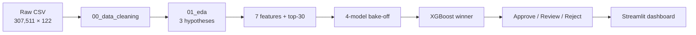

---

## Suggested speaking order

1. Problem + 8% default + 122 messy columns. (30 s)
2. Cleaning notebook: profile → sentinel → 60% drop → median / `'MISSING'` → encode → stratified split → train-only scaler. (2 min)
3. One rejected idea (mean impute, or drop 55k sentinel rows). (30 s)
4. H1 supported, H2 rejected, H3 supported-but-small-V. (2.5 min)
5. Seven engineered features; top-30 almost matches all-features AUC. (1 min)
6. Four families; how each is trained; SMOTE lost; XGBoost 0.75 / 0.76; 3-way policy. (3 min)
7. Dashboard exists if they want a demo. (30 s)

---

## 1. Problem — 30 seconds

We are predicting **whether a Home Credit applicant will default**. The table is **307,511 loans** and **122 raw columns**. Only **8.07%** default. Accuracy is a trap: a dummy that always says “no default” is already **92%** accurate. The data is messy: mixed types, housing fields missing **60–70%**, and a fake employment code of **365,243 days**. Our product is not a notebook dump. It is a pipeline that ranks risk and returns **Approve / Manual Review / Reject**.

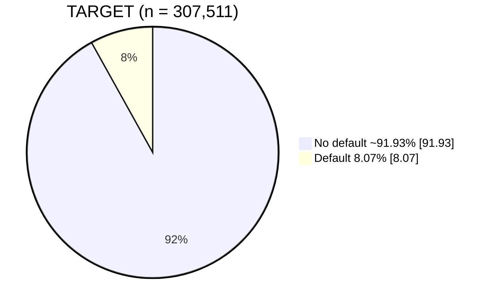

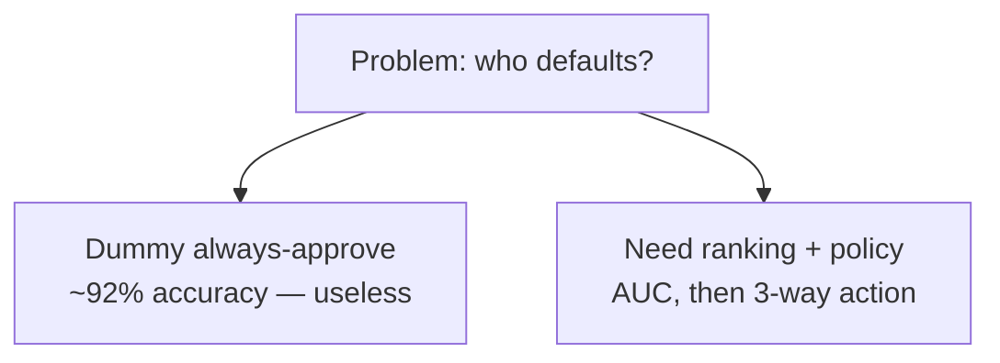

---

## 2. Cleaning — 2 minutes

Cleaning lives in **`00_data_cleaning.ipynb`**, not a hidden script. You can open it and walk load → save.

First we **profile** missingness. Red bars are columns we will drop; blue we keep.

Then the **sentinel**. **55,374** rows have `DAYS_EMPLOYED = 365243`. That is not a thousand-year job. We set it to **NaN** so it does not dominate scaling.

Then we **drop 17 columns** above **60%** missing — mostly empty housing triples like `COMMONAREA_*`. Below 60% we still keep things like `LANDAREA`.

Leftovers: **median** for numbers, a literal **`'MISSING'`** category for text. Missingness can be a signal. We do not pretend we know the occupation.

Categoricals: **one-hot** if 10 or fewer levels, **frequency** for occupation and organization so we do not explode the table.

Then a **stratified 70 / 15 / 15** split on `TARGET`: **215,257 / 46,127 / 46,127**, same **8%** default in each slice. Val picks the model. Test is frozen.

Last: **`StandardScaler` on train only**. Trees do not need it; logistic regression and the MLP do. One scaled table keeps the four models comparable. After this we have **144 columns**, no leftover sentinel, train means near zero.

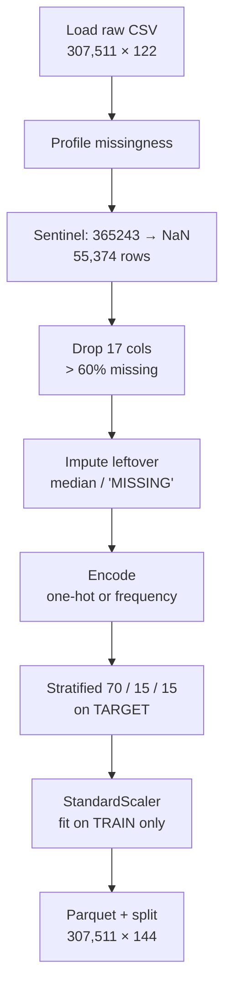

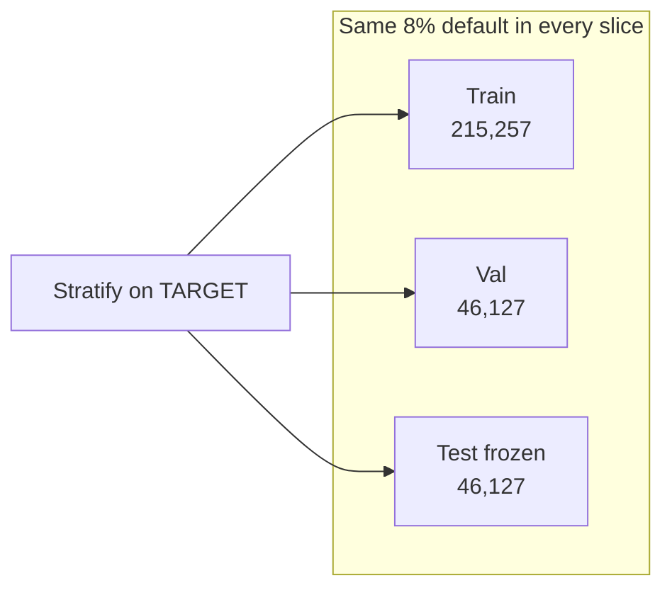

---

## 3. One rejected idea — 30 seconds

We did **not** drop those **55k** sentinel rows. That is **18%** of applicants — the unemployed or unknown-job group. Deleting them would bias the model toward people with complete job histories. We also did **not** mean-impute income and credit. Those distributions are long-tailed; the mean is pulled by outliers. **Median** stays in the body of the data.

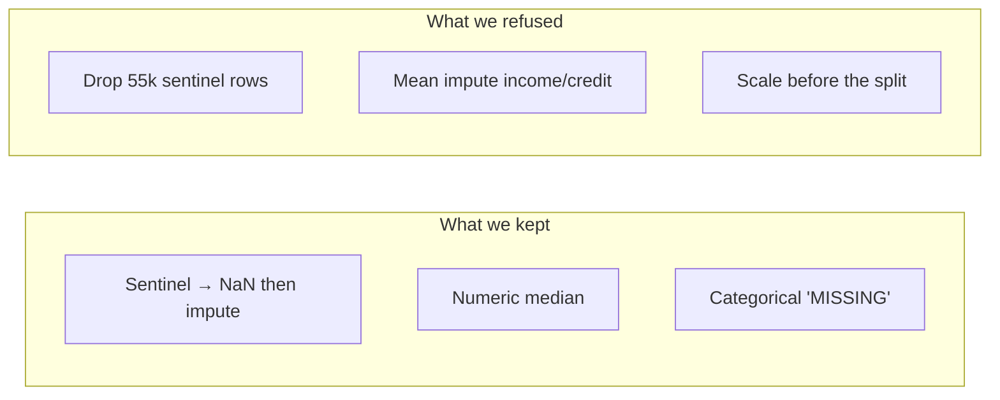

---

## 4. Three hypotheses — 2.5 minutes

EDA is **three business questions**, not 122 histograms.

**H1 — lower external bureau scores, higher default. Supported.**  
`EXT_SOURCE_1/2/3` are normalized scores from outside bureaus. Correlations with default are about **−0.16 to −0.18**. The mean score alone has AUC about **0.65**. Strongest single field: **`EXT_SOURCE_3`**. We would make it required on the application. We are **not** claiming causality.

**H2 — higher credit-to-income, higher default. Rejected as a simple rule.**  
Default by CTI **decile** is an **inverted U**: about **9.2%** in the middle, down to **7.1%** at the top. When we add `EXT_SOURCE_3` to the regression, the CTI coefficients **flip sign**. High-CTI people are also high-income and high-bureau-score. That is **Simpson’s paradox**. Do **not** ship a raw CTI cutoff.

**H3 — some education and occupation segments are riskier. Supported, small effect.**  
Low-skill laborers **17.2%** default vs accountants **4.8%** — about **3.5 times**. Education is monotonic: lower secondary **10.9%**, academic degree **1.8%**. χ² p-values are tiny because **n is 307k**. **Cramér’s V is only 0.03–0.08**. Statistically real, too weak to underwrite on its own.

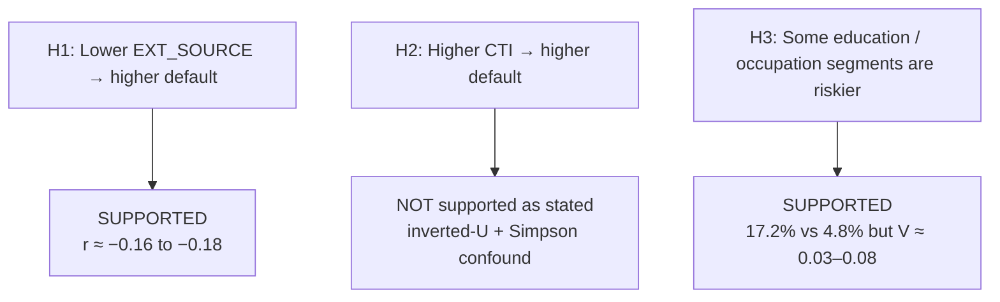

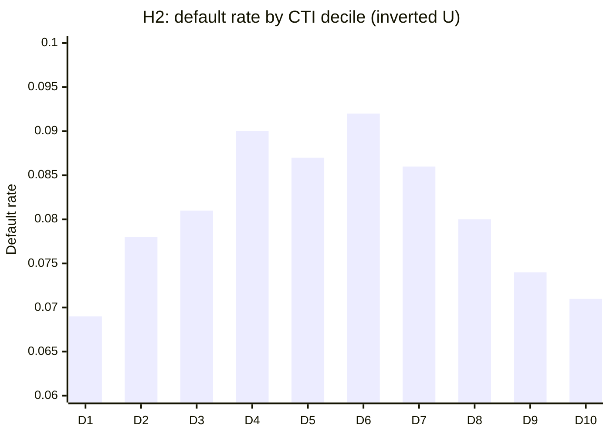

---

## 5. Features — 1 minute

We did not dump 144 columns into the models. We added **seven** named features: age and employment in **years**, credit-to-income, annuity-to-income, credit-to-goods, income per family member, and **`EXT_SOURCE_MEAN`**. Safe divide: if the denominator is zero, we get NaN, not a fake zero.

Then **top-30** by the **mean of three ranks**: XGBoost importance, Random Forest importance, and SHAP. Logistic 5-fold CV: **all features 0.7445**, **top-30 0.7397**. Gap about **half a point**. We kept top-30 so the form is usable. Top of the list is still bureau scores, then employment length.

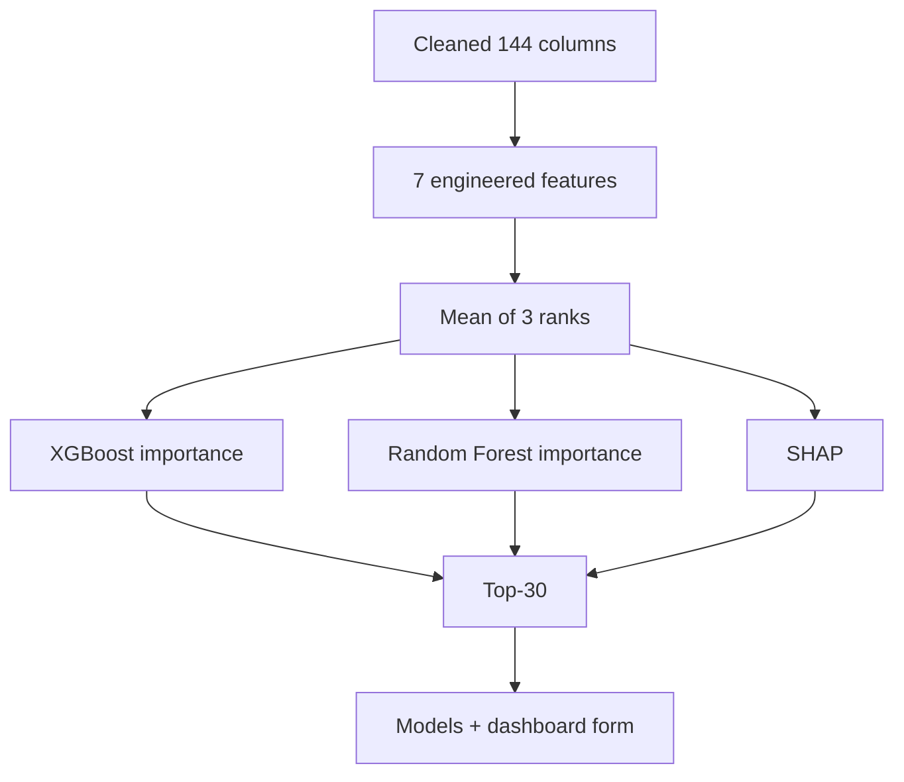

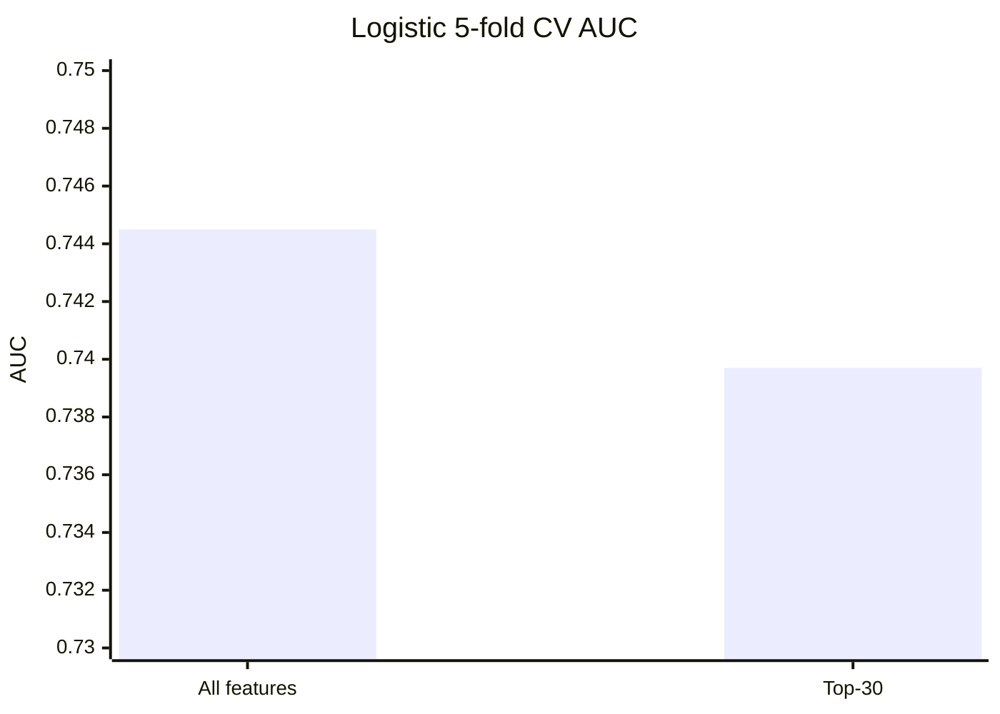

---

## 6. Models and policy — 3 minutes

Four **families**, same top-30, same frozen split. Winner chosen on **validation AUC**, test looked at **once**.

- **Logistic regression** — linear baseline. If trees cannot beat it, we should not ship a black box.
- **Random Forest** — bagged trees.
- **XGBoost** — gradient boosting; usual winner on tabular credit.
- **MLP** — PyTorch feed-forward net, hidden **128 then 64**, dropout **0.3**. Deep-learning slot; TensorFlow had no Python 3.14 wheels.

**8%** defaults. We **ran** class weighting versus **SMOTE**. SMOTE invents extra default rows from nearest neighbors. On XGBoost, weighting got **0.7539** AUC; SMOTE dropped to **0.7203**. Textbook answer lost. We kept **`scale_pos_weight ≈ 11.39`**: each default counts like about **11** non-defaults in the loss. Same idea as `class_weight` and the MLP’s `pos_weight`.

Validation AUC: **XGBoost 0.7539**, RF **0.7469**, MLP **0.7448**, logistic **0.7398**. Frozen test: **0.7578**. Not overfit. RF has a nicer F1 because it is conservative and **misses more defaults** (recall **0.39** vs XGBoost **0.68**). In credit, a false negative is expensive, so we ship XGBoost.

A single 0.50 cutoff is not a product. We wrap `score_application()` in three bands: **p < 0.20 Approve**, **0.20–0.50 Manual Review**, **p ≥ 0.50 Reject**. Low precision at 0.50 is expected at 8% prevalence; that is why the gray zone exists.

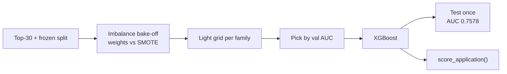

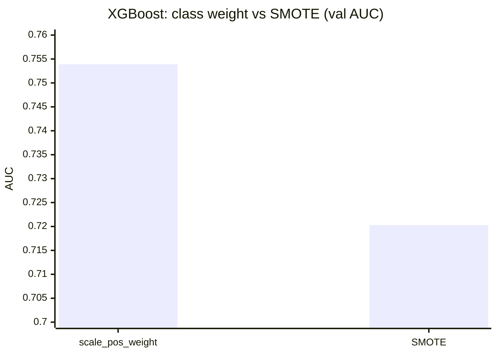

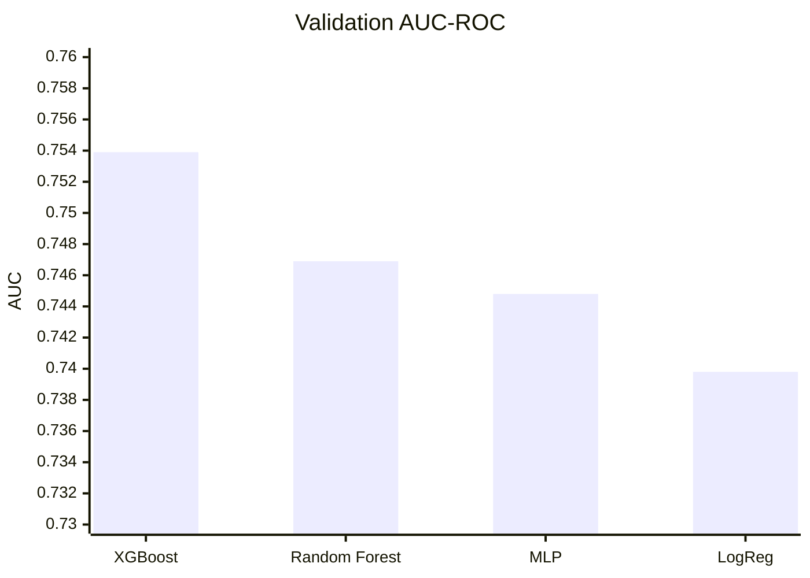

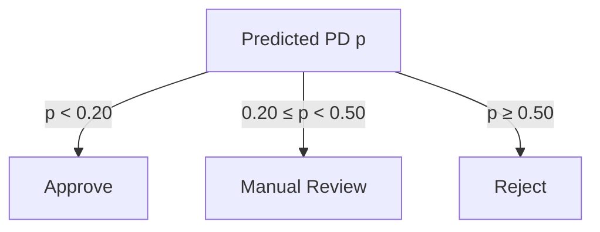

---

## 7. Dashboard — 30 seconds

Phase 5 is a **Streamlit** app: sliders for income, credit, employment, and the three `EXT_SOURCE` scores, live probability, and the three-way recommendation. Command is `streamlit run dashboard/app.py`. We can demo if you want.

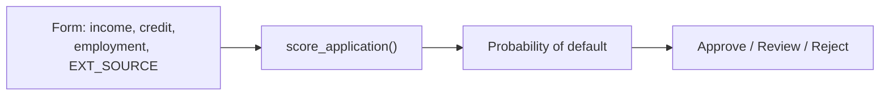

---

## Cuts and Q&A

**If you get cut off after 8 minutes**

Skip section 3 and the MLP/RF training details. Keep **H2 rejected**, **SMOTE lost**, **XGBoost 0.75 / 0.76**, **0.20 / 0.50 policy**.

**If they ask “why not Random Forest?”**

Best F1, worse default catch. We optimize **ranking and recall**, not F1. Manual Review is the F1 compromise.

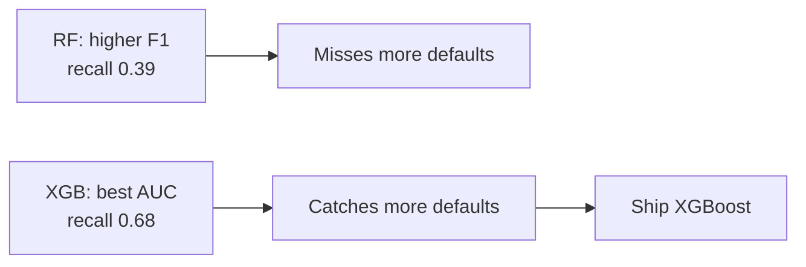
